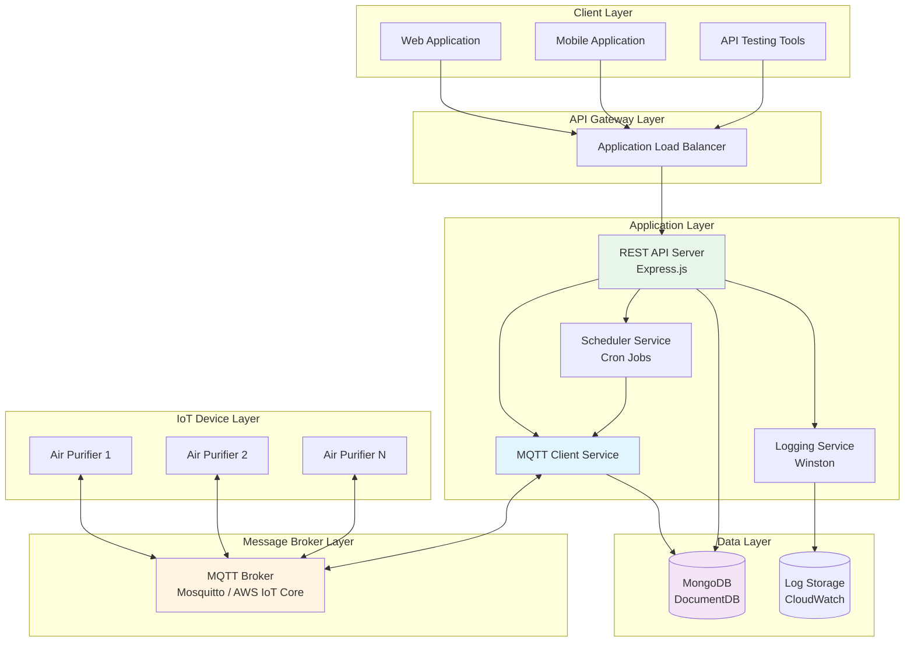
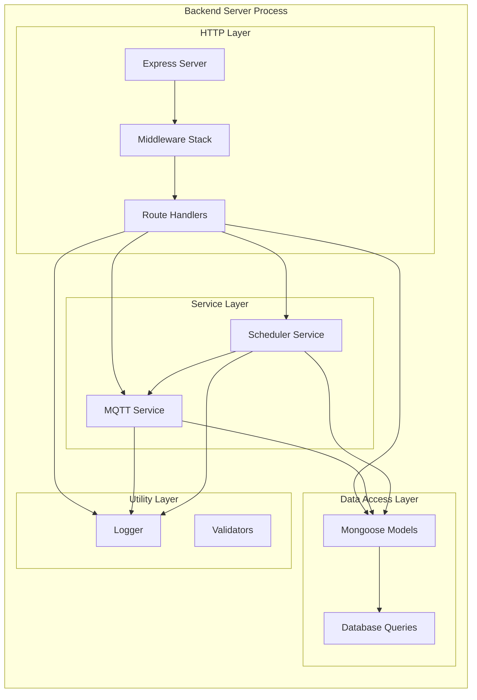
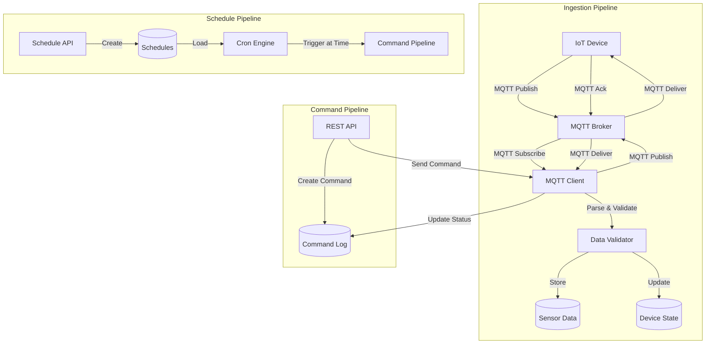
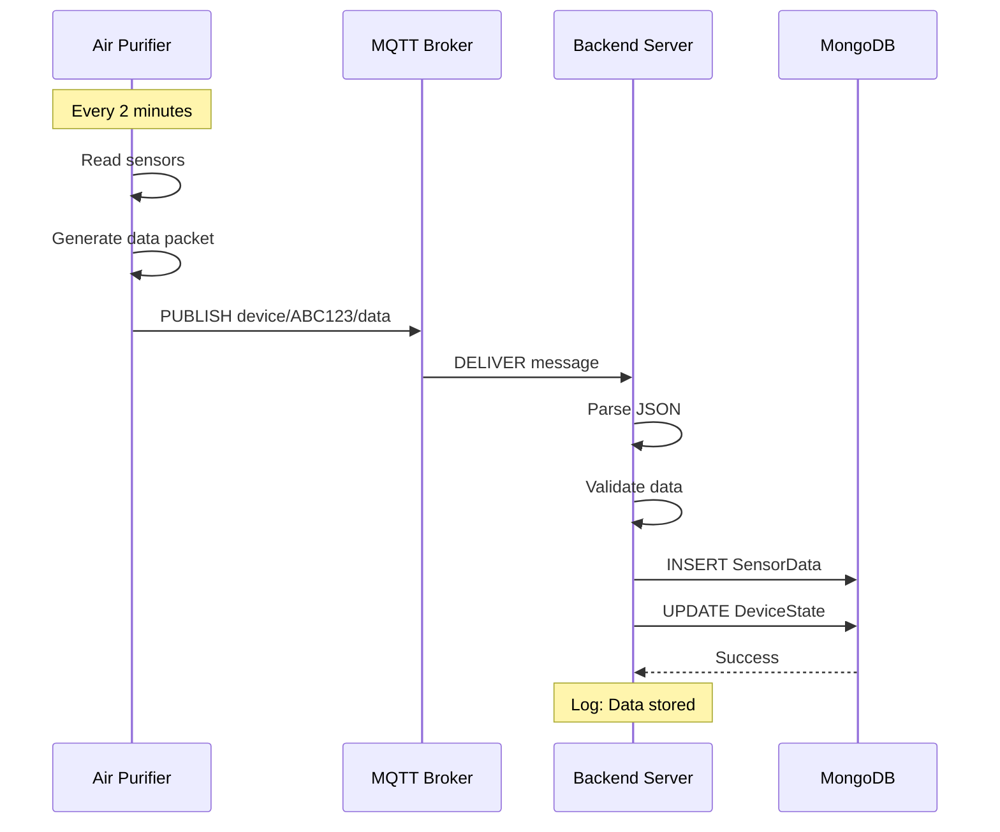
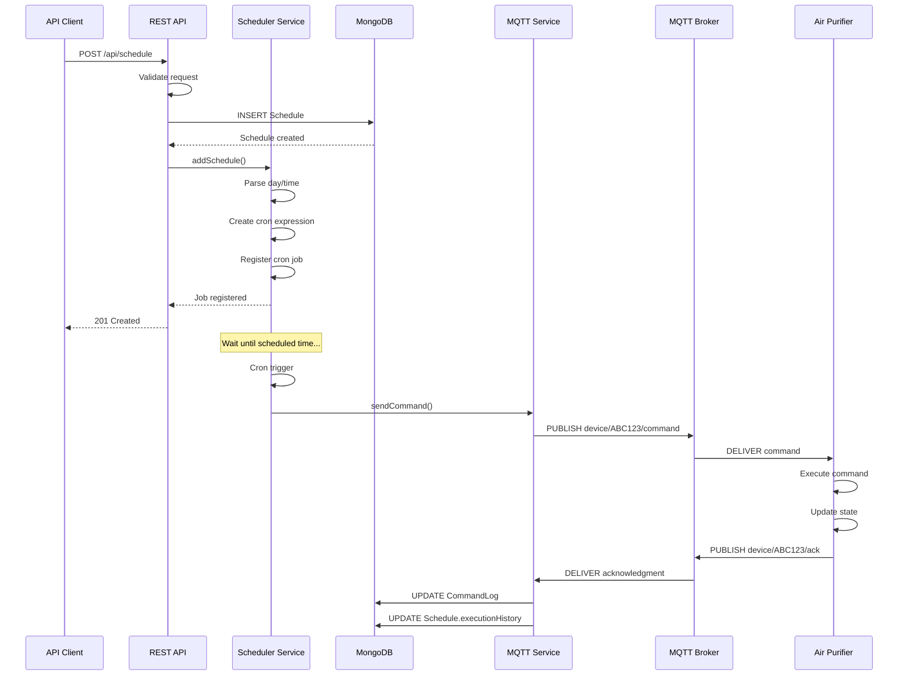
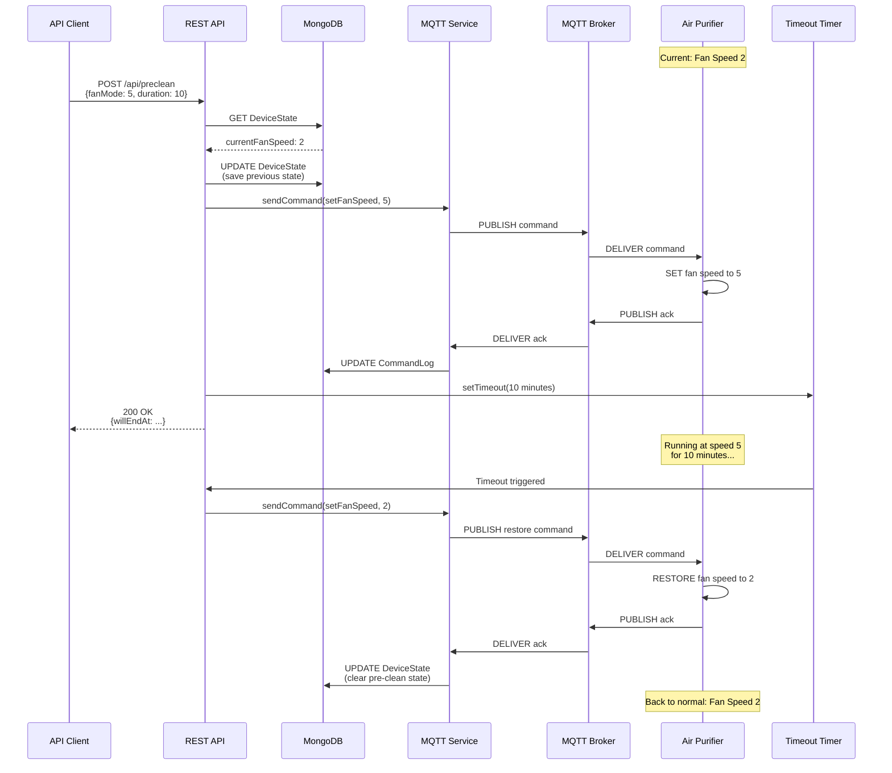
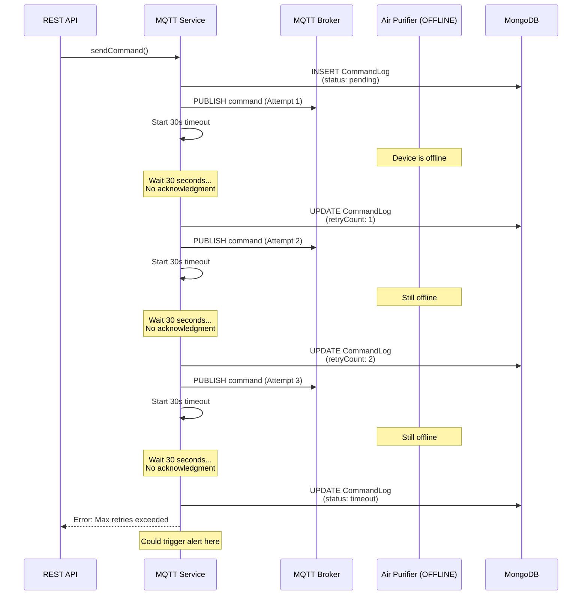

# Software Architecture Documentation

## Praan IoT Backend - Air Purifier Management System

This document provides a comprehensive overview of the system architecture, design patterns, data flows, and technical decisions.

---

## Table of Contents

1. [System Overview](#system-overview)
2. [Architecture Diagrams](#architecture-diagrams)
3. [Component Details](#component-details)
4. [Data Flow Sequences](#data-flow-sequences)
5. [Functional Requirements](#functional-requirements)
6. [Non-Functional Requirements](#non-functional-requirements)
7. [Design Patterns](#design-patterns)
8. [Technology Stack](#technology-stack)
9. [Security Considerations](#security-considerations)
10. [Scalability and Performance](#scalability-and-performance)

---

## System Overview

### Purpose
The Praan IoT Backend is a production-grade system designed to manage air purifier devices through real-time MQTT communication, providing scheduling capabilities, temporary overrides, and comprehensive data storage.

### Key Capabilities
- Real-time sensor data ingestion from IoT devices
- Device command orchestration with retry logic
- Recurring schedule management
- Temporary fan override (pre-clean) functionality
- Historical data storage and analytics
- RESTful API for client applications

---

## Architecture Diagrams

### 1. High-Level System Architecture



### 2. Detailed Component Architecture



### 3. Data Flow Architecture



---

## Component Details

### 1. IoT Device Simulator

**File**: `src/simulator/device-simulator.js`

**Responsibilities**:
- Simulate air purifier hardware
- Generate realistic sensor data
- Publish data to MQTT broker
- Listen for and execute commands
- Send acknowledgments

**Key Features**:
- Gradual sensor value changes (no sudden jumps)
- Configurable publish interval (default: 2 minutes)
- Command validation
- Automatic reconnection on disconnect
- Graceful shutdown handling

**State Management**:
```javascript
deviceState = {
  powerOn: Boolean,
  fanSpeed: Number (0-5),
  networkStrength: Number (0-100),
  sensors: {
    temperature: Number,
    humidity: Number,
    pm1: Number,
    pm25: Number,
    pm10: Number,
    sound: Number,
    voc: Number
  }
}
```

### 2. Backend Server

**File**: `src/backend/server.js`

**Responsibilities**:
- Initialize Express application
- Connect to MongoDB and MQTT
- Mount API routes
- Handle graceful shutdown
- Error handling

**Startup Sequence**:
1. Load environment variables
2. Connect to MongoDB
3. Connect to MQTT broker
4. Initialize scheduler service
5. Start HTTP server
6. Register shutdown handlers

### 3. MQTT Service

**File**: `src/backend/services/mqttService.js`

**Responsibilities**:
- Manage MQTT connection
- Subscribe to device topics
- Publish commands to devices
- Handle acknowledgments
- Implement retry logic

**Key Methods**:
- `connect()` - Connect to MQTT broker
- `handleMessage()` - Process incoming messages
- `handleSensorData()` - Store sensor data
- `handleAcknowledgment()` - Process device acks
- `sendCommand()` - Send command with retries
- `sendCommandWithRetry()` - Retry logic implementation

**Retry Logic**:
```
Attempt 1: Send command → Wait 30s for ack
  ↓ (no ack)
Attempt 2: Retry → Wait 30s for ack
  ↓ (no ack)
Attempt 3: Retry → Wait 30s for ack
  ↓ (no ack)
Mark as FAILED
```

### 4. Scheduler Service

**File**: `src/backend/services/schedulerService.js`

**Responsibilities**:
- Load schedules from database
- Create cron jobs
- Execute scheduled commands
- Track execution history
- Manage job lifecycle

**Cron Expression Format**:
```
minute hour * * day
  ↓     ↓       ↓
  0-59  0-23   0-6 (0=Sunday)

Example: "0 9 * * 1" = Every Monday at 9:00 AM
```

**Schedule Execution Flow**:
1. Load schedule from database
2. Parse day and time
3. Create cron expression
4. Create two cron jobs (start and end)
5. Register jobs in active jobs map
6. Execute commands at scheduled times

### 5. MongoDB Models

#### SensorData Model
**File**: `src/backend/models/SensorData.js`

**Purpose**: Store time-series sensor data

**Schema**:
```javascript
{
  deviceId: String (indexed),
  timestamp: Date (indexed),
  networkStrength: Number,
  temperature: Number,
  humidity: Number,
  pm1: Number,
  pm25: Number,
  pm10: Number,
  sound: Number,
  voc: Number,
  fanSpeed: Number,
  powerOn: Boolean,
  createdAt: Date,
  updatedAt: Date
}
```

**Indexes**:
- Single: `deviceId`, `timestamp`
- Compound: `{deviceId: 1, timestamp: -1}`

#### Schedule Model
**File**: `src/backend/models/Schedule.js`

**Purpose**: Store recurring schedules

**Schema**:
```javascript
{
  deviceId: String,
  day: String (enum),
  startTime: String (HH:MM),
  endTime: String (HH:MM),
  fanSpeed: Number (1-5),
  isActive: Boolean,
  lastExecuted: Date,
  executionHistory: Array,
  createdAt: Date,
  updatedAt: Date
}
```

#### DeviceState Model
**File**: `src/backend/models/DeviceState.js`

**Purpose**: Store current device state

**Schema**:
```javascript
{
  deviceId: String (unique),
  currentFanSpeed: Number,
  powerOn: Boolean,
  isOnline: Boolean,
  lastSeen: Date,
  preCleanState: Object,
  latestSensorData: Object,
  createdAt: Date,
  updatedAt: Date
}
```

#### CommandLog Model
**File**: `src/backend/models/CommandLog.js`

**Purpose**: Audit trail of all commands

**Schema**:
```javascript
{
  commandId: String (UUID),
  deviceId: String,
  action: String (enum),
  value: Number,
  source: String (enum),
  status: String (enum),
  sentAt: Date,
  acknowledgedAt: Date,
  retryCount: Number,
  errorMessage: String,
  deviceResponse: Object,
  createdAt: Date,
  updatedAt: Date
}
```

### 6. API Routes

#### Schedule Routes
**File**: `src/backend/routes/scheduleRoutes.js`

**Endpoints**:
- `POST /api/schedule` - Create schedule
- `GET /api/schedule/:deviceId` - List schedules
- `GET /api/schedule/detail/:scheduleId` - Get schedule
- `PUT /api/schedule/:scheduleId` - Update schedule
- `DELETE /api/schedule/:scheduleId` - Delete schedule

#### Pre-Clean Routes
**File**: `src/backend/routes/precleanRoutes.js`

**Endpoints**:
- `POST /api/preclean` - Start pre-clean
- `POST /api/preclean/cancel` - Cancel pre-clean
- `GET /api/preclean/status/:deviceId` - Get status

#### Device Routes
**File**: `src/backend/routes/deviceRoutes.js`

**Endpoints**:
- `GET /api/device/:deviceId/data` - Get sensor data
- `GET /api/device/:deviceId/latest` - Get latest data
- `GET /api/device/:deviceId/state` - Get device state
- `GET /api/device/:deviceId/commands` - Get command history
- `GET /api/device/:deviceId/statistics` - Get statistics
- `GET /api/device/list/all` - List all devices

---

## Data Flow Sequences

### Sequence 1: Sensor Data Ingestion



### Sequence 2: Schedule Creation and Execution



### Sequence 3: Pre-Clean with Restore



### Sequence 4: Command Retry Logic



---

## Functional Requirements

### FR1: Sensor Data Collection
**ID**: FR1  
**Priority**: High  
**Description**: System must collect sensor data from devices every 2 minutes

**Acceptance Criteria**:
- Device publishes data every 2 minutes (±5 seconds)
- Data includes all required sensors (temp, humidity, PM1, PM2.5, PM10, sound, VOC)
- Data is stored in MongoDB with timestamp
- Device state is updated with latest values

**Implementation**: Device Simulator + MQTT Service + SensorData Model

### FR2: Device Command Execution
**ID**: FR2  
**Priority**: High  
**Description**: System must send commands to devices and receive acknowledgments

**Acceptance Criteria**:
- Backend can send setFanSpeed command (0-5)
- Backend can send turnOff command
- Backend can send turnOn command
- Device executes command within 5 seconds
- Device sends acknowledgment
- Command status is tracked in database

**Implementation**: MQTT Service + Command Log Model

### FR3: Command Retry Logic
**ID**: FR3  
**Priority**: High  
**Description**: System must retry failed commands up to 3 times

**Acceptance Criteria**:
- If no acknowledgment within 30 seconds, retry
- Maximum 3 retry attempts
- Each retry is logged
- After 3 failures, mark as timeout
- Retry count is stored in database

**Implementation**: MQTT Service (sendCommandWithRetry method)

### FR4: Schedule Management
**ID**: FR4  
**Priority**: High  
**Description**: System must support recurring weekly schedules

**Acceptance Criteria**:
- User can create schedule with day, start time, end time, fan speed
- Schedule executes at specified time
- Device turns on at start time with specified fan speed
- Device turns off at end time
- Execution history is tracked
- User can list, update, and delete schedules

**Implementation**: Schedule API + Scheduler Service + Schedule Model

### FR5: Pre-Clean Functionality
**ID**: FR5  
**Priority**: High  
**Description**: System must support temporary fan override with automatic restoration

**Acceptance Criteria**:
- User can trigger pre-clean with fan mode and duration
- System saves current fan speed before override
- Device immediately changes to requested fan speed
- After duration expires, device restores to previous speed
- User can cancel pre-clean early
- User can check pre-clean status

**Implementation**: Pre-Clean API + Device State Model + Timeout Timers

### FR6: Historical Data Access
**ID**: FR6  
**Priority**: Medium  
**Description**: System must provide access to historical sensor data

**Acceptance Criteria**:
- User can query sensor data by device ID
- User can filter by date range
- User can limit number of results
- User can get latest sensor reading
- User can get statistics (min, max, avg) for time period

**Implementation**: Device API + SensorData Model

### FR7: Device State Tracking
**ID**: FR7  
**Priority**: Medium  
**Description**: System must track current state of each device

**Acceptance Criteria**:
- System knows current fan speed
- System knows power status (on/off)
- System knows online status
- System knows last seen time
- System knows if pre-clean is active

**Implementation**: Device State Model + MQTT Service

### FR8: Command Audit Trail
**ID**: FR8  
**Priority**: Medium  
**Description**: System must log all commands sent to devices

**Acceptance Criteria**:
- Every command is logged with unique ID
- Log includes action, value, source, status
- Log includes timestamps (sent, acknowledged)
- Log includes retry count
- User can query command history

**Implementation**: Command Log Model + Device API

---

## Non-Functional Requirements

### NFR1: Reliability
**ID**: NFR1  
**Priority**: High  
**Description**: System must be reliable and handle failures gracefully

**Requirements**:
- Automatic reconnection on MQTT disconnect
- Automatic reconnection on MongoDB disconnect
- Graceful shutdown (save state, close connections)
- Command retry logic (3 attempts)
- Error logging for all failures
- No data loss on temporary disconnections

**Implementation**:
- MQTT client with reconnect option
- Mongoose with auto-reconnect
- Graceful shutdown handlers
- Retry logic in MQTT Service
- Winston logger with file persistence

### NFR2: Performance
**ID**: NFR2  
**Priority**: High  
**Description**: System must handle data and commands efficiently

**Requirements**:
- Sensor data ingestion: < 100ms per message
- Command execution: < 5 seconds end-to-end
- API response time: < 200ms (excluding device communication)
- Support 100+ concurrent devices
- Database queries: < 500ms

**Implementation**:
- Indexed MongoDB collections
- Async/await for non-blocking operations
- Connection pooling
- Efficient data structures

### NFR3: Scalability
**ID**: NFR3  
**Priority**: Medium  
**Description**: System must scale to support growing number of devices

**Requirements**:
- Horizontal scaling support (multiple backend instances)
- Database sharding support
- MQTT broker clustering support
- Stateless API design (except pre-clean timers)
- Load balancer compatible

**Implementation**:
- Stateless Express server
- MongoDB with replica sets
- AWS ECS Fargate for auto-scaling
- Application Load Balancer

### NFR4: Maintainability
**ID**: NFR4  
**Priority**: Medium  
**Description**: System must be easy to maintain and debug

**Requirements**:
- Comprehensive logging (info, warn, error)
- Clear code structure and comments
- Separation of concerns (routes, services, models)
- Error messages with context
- Health check endpoint

**Implementation**:
- Winston logger with multiple transports
- Modular architecture
- Detailed inline comments
- Structured error handling
- `/health` endpoint

### NFR5: Security
**ID**: NFR5  
**Priority**: High (for production)  
**Description**: System must protect data and prevent unauthorized access

**Requirements** (for production):
- MQTT TLS encryption
- MQTT authentication (username/password)
- API authentication (JWT tokens)
- API rate limiting
- Input validation and sanitization
- Secrets management (AWS Secrets Manager)
- HTTPS only

**Current Implementation** (development):
- Basic input validation
- No authentication (for simplicity)
- HTTP (not HTTPS)

**Production Implementation**:
- Add authentication middleware
- Use AWS IoT Core (built-in TLS)
- Use API Gateway with authentication
- Add rate limiting middleware
- Store secrets in AWS Secrets Manager

### NFR6: Availability
**ID**: NFR6  
**Priority**: High  
**Description**: System must be highly available

**Requirements**:
- 99.9% uptime target
- Multi-AZ deployment
- Database replication
- Automatic failover
- Health monitoring

**Implementation**:
- AWS ECS with multiple instances
- MongoDB replica set
- Application Load Balancer health checks
- CloudWatch monitoring

### NFR7: Data Retention
**ID**: NFR7  
**Priority**: Medium  
**Description**: System must manage data storage efficiently

**Requirements**:
- Sensor data: Retain 90 days
- Command logs: Retain 30 days
- Schedules: Retain indefinitely (until deleted)
- Device state: Retain indefinitely

**Implementation** (future):
- MongoDB TTL indexes
- Scheduled cleanup jobs
- Data archival to S3

---

## Design Patterns

### 1. Singleton Pattern
**Used In**: MQTT Service, Scheduler Service

**Why**: 
- Only one MQTT connection needed
- Only one scheduler instance needed
- Shared state across application

**Implementation**:
```javascript
class MQTTService {
  // ... class definition
}

module.exports = new MQTTService(); // Export instance, not class
```

### 2. Observer Pattern
**Used In**: MQTT message handling

**Why**:
- Multiple handlers for different message types
- Decoupled message processing
- Easy to add new message handlers

**Implementation**:
```javascript
client.on('message', async (topic, message) => {
  await this.handleMessage(topic, message);
});
```

### 3. Strategy Pattern
**Used In**: Command execution

**Why**:
- Different command types (setFanSpeed, turnOff, turnOn)
- Easy to add new command types
- Encapsulated command logic

**Implementation**:
```javascript
switch (action) {
  case 'setFanSpeed':
    // Strategy for fan speed
    break;
  case 'turnOff':
    // Strategy for turn off
    break;
}
```

### 4. Repository Pattern
**Used In**: Mongoose models

**Why**:
- Abstraction over data access
- Centralized query logic
- Easy to change database

**Implementation**:
```javascript
// Model acts as repository
const sensorData = await SensorData.find({ deviceId });
```

### 5. Middleware Pattern
**Used In**: Express middleware

**Why**:
- Request/response processing pipeline
- Cross-cutting concerns (logging, validation)
- Reusable functionality

**Implementation**:
```javascript
app.use(cors());
app.use(express.json());
app.use((req, res, next) => {
  logger.info(`${req.method} ${req.path}`);
  next();
});
```

---

## Technology Stack

### Backend
- **Node.js** (v18+) - JavaScript runtime
- **Express.js** (v4) - Web framework
- **Mongoose** (v8) - MongoDB ODM
- **MQTT.js** (v5) - MQTT client
- **node-cron** (v3) - Job scheduler
- **Winston** (v3) - Logger

### Database
- **MongoDB** (v7) - NoSQL database
- **AWS DocumentDB** (production) - Managed MongoDB

### Message Broker
- **Mosquitto** (v2) - MQTT broker
- **AWS IoT Core** (production) - Managed MQTT

### DevOps
- **Docker** - Containerization
- **Docker Compose** - Local development
- **AWS ECS Fargate** - Container orchestration
- **AWS CloudFormation** - Infrastructure as code
- **AWS ECR** - Container registry
- **AWS ALB** - Load balancing

### Monitoring
- **Winston** - Application logging
- **AWS CloudWatch** - Log aggregation and monitoring

---

## Security Considerations

### Current Implementation (Development)

**Strengths**:
- Input validation on API endpoints
- Mongoose schema validation
- Error handling without exposing internals

**Weaknesses** (acceptable for development):
- No authentication
- No MQTT encryption
- No API rate limiting
- Secrets in environment variables

### Production Recommendations

1. **Authentication & Authorization**
   - Implement JWT-based authentication
   - Add role-based access control (RBAC)
   - Use API Gateway with Cognito

2. **MQTT Security**
   - Use TLS encryption (port 8883)
   - Implement device certificates
   - Use AWS IoT Core with device authentication

3. **API Security**
   - Add rate limiting (express-rate-limit)
   - Implement request validation (joi)
   - Add CORS whitelist
   - Use HTTPS only

4. **Secrets Management**
   - Use AWS Secrets Manager
   - Rotate credentials regularly
   - Never commit secrets to git

5. **Network Security**
   - Use VPC with private subnets
   - Security groups with least privilege
   - WAF for API protection

---

## Scalability and Performance

### Current Capacity

**Single Instance**:
- 100+ concurrent devices
- 1000+ API requests/minute
- 50+ sensor readings/minute

### Scaling Strategy

#### Horizontal Scaling
```
1 Backend Instance → N Backend Instances
  ↓
Load Balancer distributes traffic
  ↓
All instances share MongoDB and MQTT broker
```

**Considerations**:
- Pre-clean timers are in-memory (need distributed solution)
- Scheduler needs leader election (only one instance runs crons)

**Solutions**:
- Use Redis for distributed timers
- Use AWS EventBridge for schedules
- Use Bull Queue for job distribution

#### Database Scaling
```
Single MongoDB → Replica Set → Sharded Cluster
```

**Sharding Strategy**:
- Shard key: `deviceId`
- Each shard handles subset of devices
- Horizontal scaling for storage and throughput

#### MQTT Scaling
```
Single Broker → Broker Cluster
```

**Options**:
- AWS IoT Core (auto-scaling)
- EMQX cluster (self-hosted)
- HiveMQ cluster (self-hosted)

### Performance Optimization

1. **Database Indexes**
   - Compound indexes on common queries
   - TTL indexes for data retention
   - Covered queries where possible

2. **Caching**
   - Redis for device state
   - In-memory cache for schedules
   - CDN for static assets

3. **Query Optimization**
   - Limit result sets
   - Use projection to select fields
   - Aggregate queries for statistics

4. **Connection Pooling**
   - MongoDB connection pool
   - MQTT connection reuse
   - HTTP keep-alive

---

## Conclusion

This architecture provides a solid foundation for an IoT backend system with:
- Clear separation of concerns
- Scalable design
- Reliable communication
- Comprehensive data management
- Production-ready deployment options

The system can be extended with additional features like:
- Real-time dashboards
- Alert notifications
- Machine learning for predictive maintenance
- Multi-tenant support
- Advanced analytics

---

**Document Version**: 1.0  
**Last Updated**: December 26, 2024  
**Author**: Praan IoT Team

