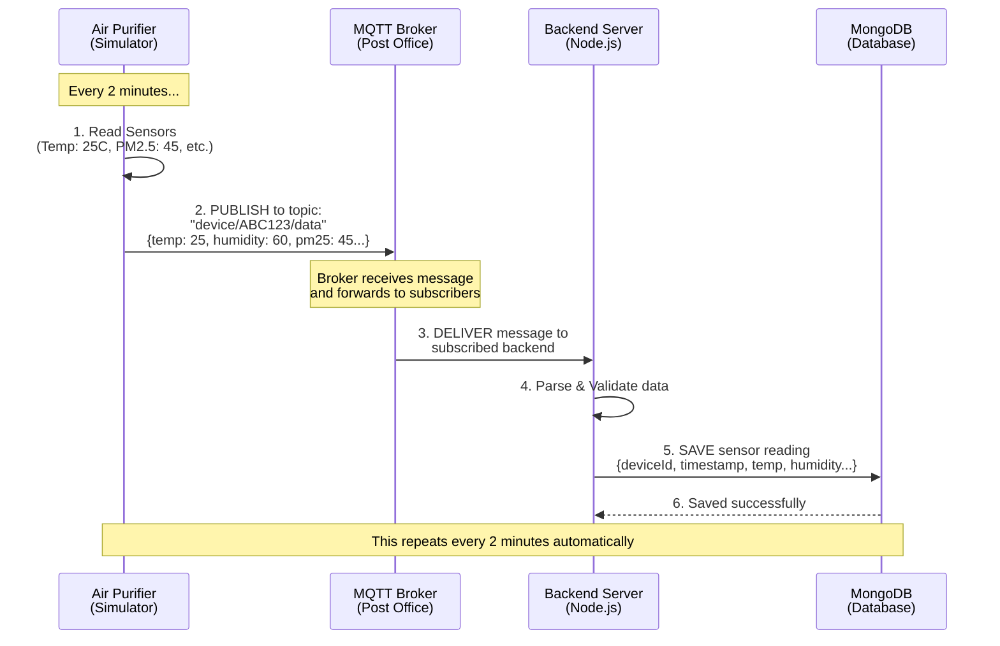
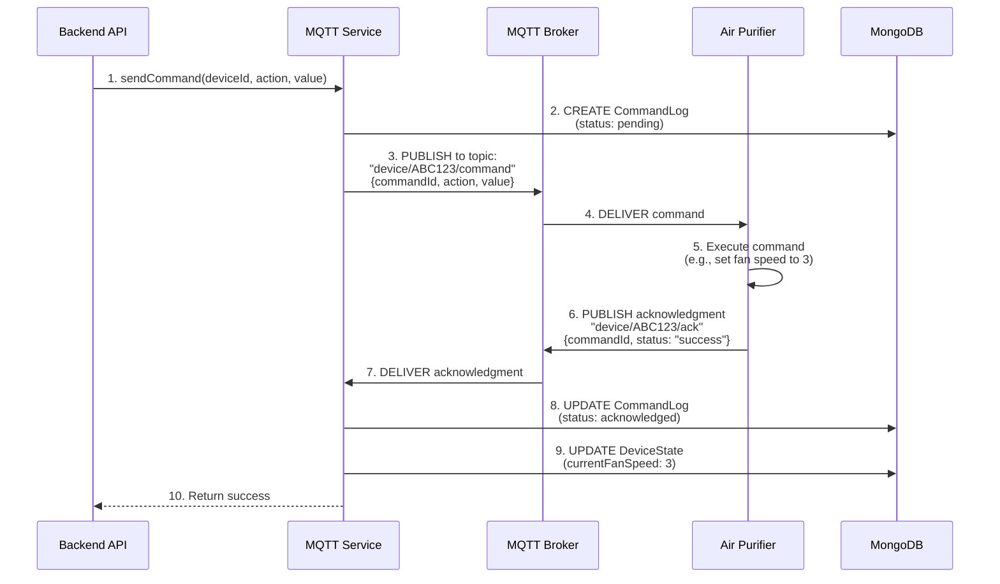
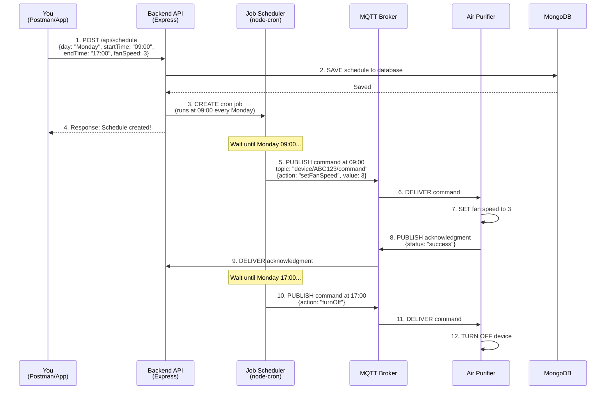
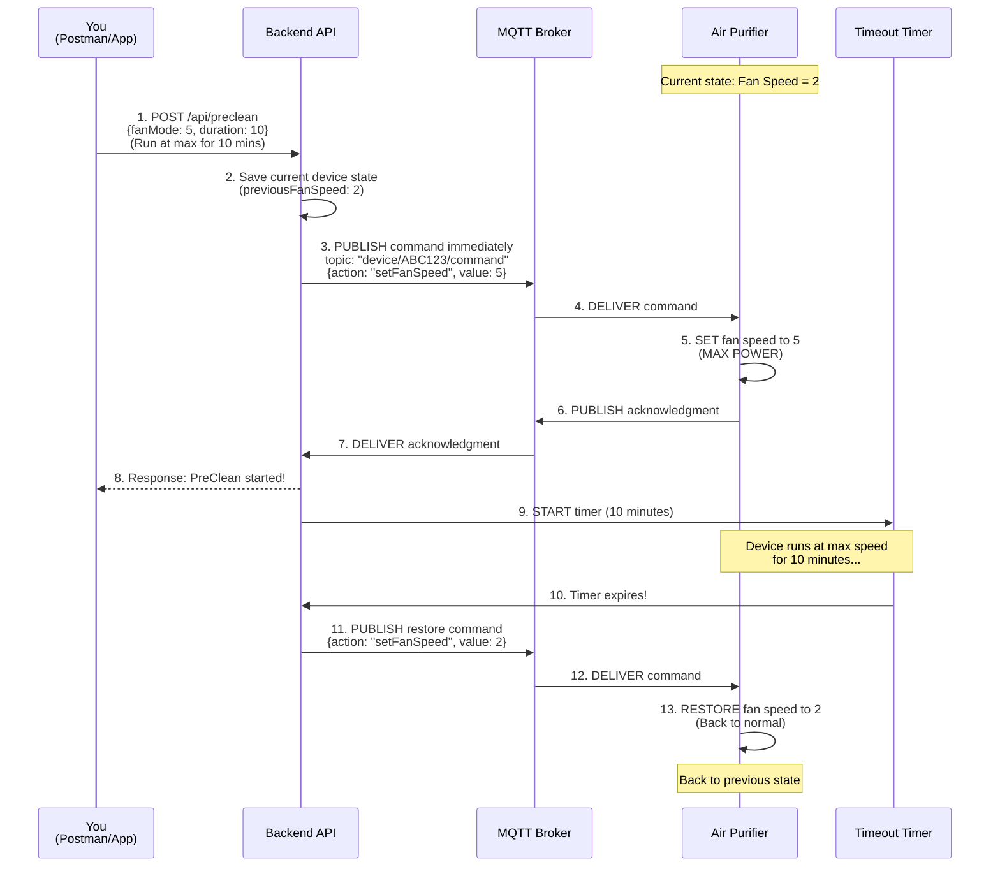
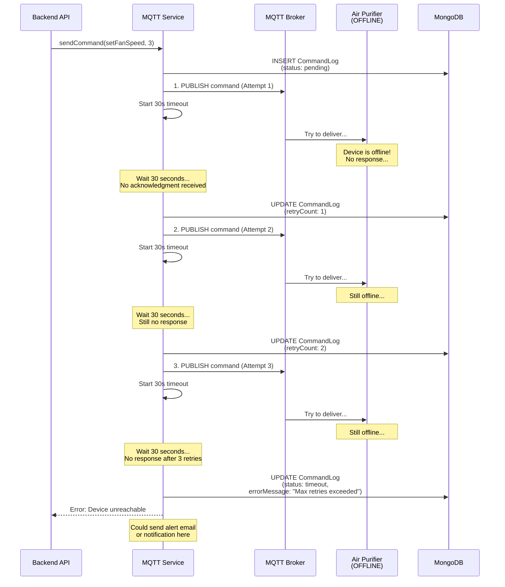
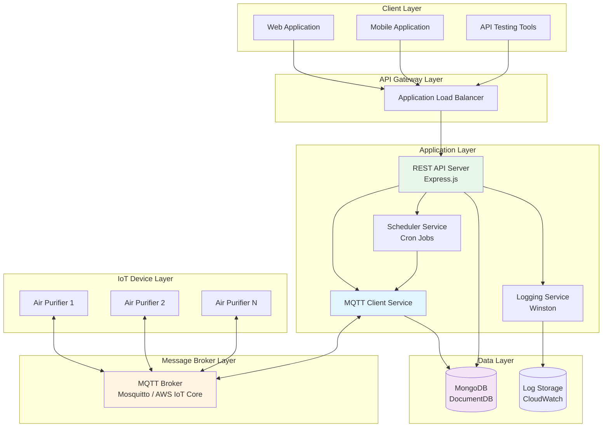

# System Flows and Diagrams

This document contains all the mermaid diagrams and detailed flow explanations for the Praan IoT Backend system.

---

## Table of Contents

1. [Data Flow: Device to Backend](#1-data-flow-device-to-backend)
2. [Command Flow: Backend to Device](#2-command-flow-backend-to-device)
3. [Schedule API Flow](#3-schedule-api-flow)
4. [Pre-Clean API Flow](#4-pre-clean-api-flow)
5. [Error Handling Flow](#5-error-handling-flow)
6. [Complete System Architecture](#6-complete-system-architecture)

---

## 1. Data Flow: Device to Backend

### What This Flow Does
This shows how sensor data travels from the air purifier device to the backend server and gets stored in the database.

### Diagram



### Step-by-Step Explanation

**Step 1: Read Sensors**
- The device (air purifier simulator) reads all its sensors
- Gets values like: temperature (25°C), humidity (60%), PM2.5 (45), etc.
- This happens automatically every 2 minutes

**Step 2: Publish to MQTT Broker**
- Device creates a JSON message with all sensor data
- Publishes message to MQTT topic: `device/ABC123/data`
- Topic is like an address - tells broker where to send the message
- Message format:
  ```json
  {
    "deviceId": "AIR_PURIFIER_001",
    "timestamp": "2024-12-26T10:00:00Z",
    "temperature": 25,
    "humidity": 60,
    "pm25": 45,
    ...
  }
  ```

**Step 3: Broker Delivers Message**
- MQTT broker receives the message
- Checks who is subscribed to `device/+/data` topic
- Forwards message to all subscribers (backend server)
- Like a post office delivering mail to subscribers

**Step 4: Backend Parses and Validates**
- Backend receives the message
- Parses JSON to extract data
- Validates that all required fields are present
- Checks data types and ranges

**Step 5: Save to Database**
- Backend creates a new SensorData document
- Saves to MongoDB with all sensor values
- Also updates DeviceState with latest values
- Records timestamp for historical tracking

**Step 6: Confirmation**
- Database confirms data was saved successfully
- Backend logs success message
- Ready for next sensor reading

**Repeat**: This entire process repeats every 2 minutes automatically!

---

## 2. Command Flow: Backend to Device

### What This Flow Does
This shows how commands travel from the backend to the device, and how the device responds with acknowledgments.

### Diagram



### Step-by-Step Explanation

**Step 1: API Requests Command**
- API endpoint (Schedule or Pre-Clean) calls MQTT Service
- Provides: deviceId, action (setFanSpeed), value (3)
- Example: "Set fan speed to 3 for device ABC123"

**Step 2: Create Command Log**
- MQTT Service generates unique commandId (UUID)
- Creates CommandLog entry in database
- Status: "pending" (waiting to be sent)
- Stores timestamp, action, value, source

**Step 3: Publish to MQTT Broker**
- MQTT Service publishes command to topic: `device/ABC123/command`
- Message includes: commandId, action, value, timestamp
- QoS 1 (at least once delivery)

**Step 4: Broker Delivers Command**
- Broker receives command
- Finds device subscribed to `device/ABC123/command`
- Delivers message to device

**Step 5: Device Executes Command**
- Device receives command message
- Parses JSON to extract action and value
- Executes command (e.g., changes fan speed to 3)
- Updates internal state

**Step 6: Device Sends Acknowledgment**
- Device creates acknowledgment message
- Includes: commandId, status ("success" or "error"), message
- Publishes to topic: `device/ABC123/ack`
- Confirms command was received and executed

**Step 7: Broker Delivers Acknowledgment**
- Broker receives acknowledgment from device
- Forwards to backend (subscribed to `device/+/ack`)

**Step 8: Update Command Log**
- MQTT Service receives acknowledgment
- Updates CommandLog in database
- Status changes from "pending" to "acknowledged"
- Records acknowledgedAt timestamp

**Step 9: Update Device State**
- Updates DeviceState collection
- Sets currentFanSpeed to 3
- Updates lastSeen timestamp
- Marks device as online

**Step 10: Return Success**
- MQTT Service returns success to API
- API can respond to client
- Command execution complete!

---

## 3. Schedule API Flow

### What This Flow Does
This shows how recurring schedules are created and executed automatically at specified times.

### Diagram



### Step-by-Step Explanation

**Step 1: User Creates Schedule**
- User sends POST request to `/api/schedule`
- Specifies: day (Monday), startTime (09:00), endTime (17:00), fanSpeed (3)
- Means: "Every Monday, turn on at 9am with speed 3, turn off at 5pm"

**Step 2: Save to Database**
- API validates the request (checks time format, fan speed range, etc.)
- Creates Schedule document in MongoDB
- Stores all schedule parameters
- Marks as active

**Step 3: Create Cron Job**
- API calls Scheduler Service
- Scheduler converts day and time to cron expression
  - "Monday 09:00" → `0 9 * * 1` (minute hour * * day)
  - "Monday 17:00" → `0 17 * * 1`
- Creates two cron jobs: one for start, one for end
- Registers jobs in active jobs map

**Step 4: Respond to User**
- API returns success response with schedule details
- Includes scheduleId for future reference
- User knows schedule is created

**Step 5-9: Start Time Execution (Monday 09:00)**
- Cron job triggers at 09:00 on Monday
- Scheduler calls MQTT Service to send command
- Command: setFanSpeed with value 3
- Device receives, executes, and acknowledges
- Schedule execution history is updated

**Step 10-12: End Time Execution (Monday 17:00)**
- Cron job triggers at 17:00 on Monday
- Scheduler sends turnOff command
- Device turns off
- Schedule execution complete for this week

**Repeat**: Next Monday, the same thing happens automatically!

### Error Handling in Schedules

If device is offline:
1. Command is sent (no acknowledgment)
2. MQTT Service waits 30 seconds
3. Retries command (up to 3 times)
4. If still no response, marks as failed
5. Logs error in schedule execution history
6. Will try again next week

---

## 4. Pre-Clean API Flow

### What This Flow Does
This shows how temporary fan overrides work - device runs at max power for a short time, then automatically restores to previous state.

### Diagram



### Step-by-Step Explanation

**Initial State**
- Device is running with fan speed 2
- User wants to boost to max (5) for 10 minutes

**Step 1: User Requests Pre-Clean**
- User sends POST request to `/api/preclean`
- Specifies: fanMode (5), duration (10 minutes)
- Means: "Run at max speed for 10 minutes, then go back to normal"

**Step 2: Save Current State**
- API queries DeviceState from database
- Finds currentFanSpeed is 2
- Saves this value (previousFanSpeed: 2)
- Updates DeviceState with pre-clean info:
  ```javascript
  preCleanState: {
    isActive: true,
    previousFanSpeed: 2,
    startedAt: now,
    duration: 10
  }
  ```

**Step 3: Send Boost Command**
- API immediately sends command to set fan speed to 5
- No waiting - command sent right away
- Source: "preclean"

**Step 4-5: Device Boosts**
- Device receives command
- Changes fan speed from 2 to 5
- Now running at maximum power

**Step 6-7: Device Acknowledges**
- Device sends acknowledgment
- Backend receives confirmation
- Knows command was successful

**Step 8: Respond to User**
- API responds to user with success
- Includes: startedAt, willEndAt timestamps
- User knows pre-clean is active

**Step 9: Start Timer**
- API creates JavaScript timeout: `setTimeout(restoreFunction, 10 * 60 * 1000)`
- Timer will trigger after 10 minutes
- Stores timeout ID for potential cancellation

**Step 10: Timer Expires**
- After 10 minutes, timeout triggers
- Calls restore function
- Time to restore previous state!

**Step 11-13: Restore Previous State**
- API sends command to set fan speed back to 2
- Device receives and executes
- Fan speed returns to 2
- Device back to normal operation

**Cleanup**
- API updates DeviceState:
  ```javascript
  preCleanState: {
    isActive: false,
    previousFanSpeed: null
  }
  ```
- Removes timeout from active timers map
- Pre-clean complete!

### Pre-Clean Cancellation

User can cancel early:
1. POST `/api/preclean/cancel` with deviceId
2. API clears timeout (stops timer)
3. Immediately sends restore command
4. Device returns to previous state
5. Pre-clean cancelled!

---

## 5. Error Handling Flow

### What This Flow Does
This shows what happens when a device is offline and doesn't respond to commands.

### Diagram



### Step-by-Step Explanation

**Initial Situation**
- API wants to send command to device
- Device is offline (powered off, no internet, etc.)

**Attempt 1**
1. MQTT Service publishes command to broker
2. Starts 30-second timeout timer
3. Waits for acknowledgment
4. Timer expires - no acknowledgment received
5. Updates CommandLog with retryCount: 1

**Attempt 2**
1. MQTT Service tries again
2. Publishes same command to broker
3. Starts another 30-second timeout
4. Still no acknowledgment
5. Updates CommandLog with retryCount: 2

**Attempt 3 (Final)**
1. MQTT Service makes final attempt
2. Publishes command one last time
3. Waits 30 seconds
4. Still no acknowledgment
5. Gives up after 3 attempts

**Failure Handling**
1. Updates CommandLog:
   - status: "timeout"
   - errorMessage: "No acknowledgment after 3 retries"
2. Returns error to API
3. API can notify user or log error
4. Could trigger alert system (email, SMS, etc.)

**Total Time**: 3 attempts × 30 seconds = 90 seconds

### Why This Matters

**For Schedules**:
- If device is offline during scheduled time
- System tries 3 times over 90 seconds
- If device comes online during retries, command succeeds
- If not, logs failure and tries again next week

**For Pre-Clean**:
- If device is offline
- System tries 3 times
- Returns error to user
- User knows device is unreachable

**For Monitoring**:
- CommandLog tracks all attempts
- Can analyze failure patterns
- Can alert if device offline too long

---

## 6. Complete System Architecture

### What This Shows
This is the complete picture of how all components work together.

### Diagram



### Component Explanation

**Client Layer**
- Web applications, mobile apps, or testing tools
- Users interact with system through these
- Send HTTP requests to backend

**API Gateway Layer**
- Application Load Balancer (AWS)
- Distributes traffic across multiple backend instances
- Provides single entry point
- Health checks and auto-scaling

**Application Layer**

1. **REST API Server (Express.js)**
   - Handles HTTP requests
   - Validates input
   - Coordinates between services
   - Returns responses

2. **MQTT Client Service**
   - Manages MQTT connection
   - Subscribes to device topics
   - Publishes commands
   - Handles acknowledgments
   - Implements retry logic

3. **Scheduler Service**
   - Manages cron jobs
   - Executes scheduled commands
   - Tracks execution history

4. **Logging Service**
   - Logs all events
   - Writes to files and console
   - Sends logs to CloudWatch (AWS)

**Message Broker Layer**
- MQTT Broker (Mosquitto or AWS IoT Core)
- Central hub for device communication
- Routes messages between devices and backend
- Handles pub/sub pattern

**Data Layer**

1. **MongoDB**
   - Stores sensor data
   - Stores schedules
   - Stores device state
   - Stores command logs

2. **Log Storage**
   - Stores application logs
   - CloudWatch on AWS
   - Used for monitoring and debugging

**IoT Device Layer**
- Multiple air purifier devices
- Each has unique device ID
- Publishes sensor data
- Receives and executes commands
- Sends acknowledgments

### Data Flow Summary

**Sensor Data Flow**:
```
Device → MQTT Broker → Backend → MongoDB
```

**Command Flow**:
```
Client → API → MQTT Service → MQTT Broker → Device
Device → MQTT Broker → MQTT Service → MongoDB
```

**Schedule Flow**:
```
Client → API → Scheduler → MQTT Service → Device
```

**Pre-Clean Flow**:
```
Client → API → MQTT Service → Device
(wait duration)
Timer → API → MQTT Service → Device (restore)
```

---

## Summary

These flows and diagrams show:

1. **Data Flow** - How sensor data travels from device to database
2. **Command Flow** - How commands travel from backend to device
3. **Schedule Flow** - How recurring schedules work automatically
4. **Pre-Clean Flow** - How temporary overrides work with restoration
5. **Error Handling** - How system handles offline devices with retries
6. **System Architecture** - How all components work together

Each flow is designed to be:
- **Reliable** - Retry logic and error handling
- **Traceable** - Everything logged in database
- **Scalable** - Can handle many devices
- **Maintainable** - Clear separation of concerns

---

**Document Version**: 1.0  
**Last Updated**: December 26, 2024

