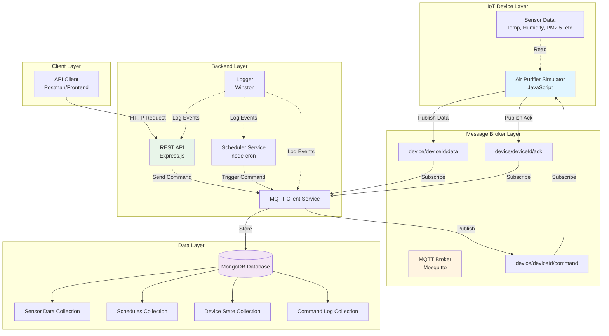

# Praan IoT Backend - Air Purifier Management System

A production-grade IoT backend system for managing air purifier devices with real-time MQTT data ingestion, device command orchestration, scheduling, and temporary override logic.

## Table of Contents

- [Overview](#overview)
- [Features](#features)
- [Architecture](#architecture)
- [Prerequisites](#prerequisites)
- [Installation](#installation)
- [Running the System](#running-the-system)
- [API Documentation](#api-documentation)
- [MQTT Topics and Message Formats](#mqtt-topics-and-message-formats)
- [Database Schemas](#database-schemas)
- [AWS Deployment](#aws-deployment)
- [Testing](#testing)
- [Troubleshooting](#troubleshooting)
- [Trade-offs and Design Decisions](#trade-offs-and-design-decisions)
- [Assumptions](#assumptions)

---

## Overview

This system consists of three main components:

1. **IoT Device Simulator** - Simulates an air purifier device that publishes sensor data and responds to commands
2. **Backend Server** - Node.js server that manages devices, stores data, and provides REST APIs
3. **MQTT Broker** - Message broker (Mosquitto) that facilitates communication between devices and backend

### What This System Does (Simple Explanation)

Think of this like a smart home system for air purifiers:

- **The Air Purifier (Simulator)**: A fake air purifier that sends information about air quality every 2 minutes
- **The Backend Server**: The brain that receives data, stores it, and can control the air purifier
- **MQTT Broker**: Like a post office that delivers messages between the air purifier and the server
- **APIs**: Remote controls that let you schedule when the purifier runs or boost it temporarily

---

## Features

### Device Simulator
- Publishes sensor data every 2 minutes (temperature, humidity, PM2.5, etc.)
- Gradual sensor value changes (realistic simulation)
- Responds to commands (set fan speed, turn off)
- Sends acknowledgments for received commands

### Backend Server
- Real-time MQTT data ingestion
- Stores all sensor data in MongoDB
- RESTful APIs for device management
- Recurring schedule management with cron jobs
- Temporary fan override (pre-clean) functionality
- Automatic state restoration after pre-clean
- Command retry logic (up to 3 attempts)
- Comprehensive logging
- Health check endpoints

### APIs
1. **Schedule API** - Create recurring schedules (e.g., "Every Monday 9am-5pm, run at speed 3")
2. **Pre-Clean API** - Temporary fan boost (e.g., "Run at max speed for 10 minutes")
3. **Device API** - Get sensor data, device state, statistics, and command history

---

## Architecture

### System Architecture Diagram



### Component Breakdown

#### 1. Device Simulator (`src/simulator/device-simulator.js`)
- **Purpose**: Simulates a real air purifier device
- **Responsibilities**:
  - Generate realistic sensor data with gradual changes
  - Publish data to MQTT every 2 minutes
  - Listen for and execute commands
  - Send acknowledgments

#### 2. Backend Server (`src/backend/server.js`)
- **Purpose**: Main application server
- **Responsibilities**:
  - Initialize all services
  - Provide REST API endpoints
  - Handle graceful shutdown

#### 3. MQTT Service (`src/backend/services/mqttService.js`)
- **Purpose**: Handle all MQTT communication
- **Responsibilities**:
  - Connect to MQTT broker
  - Subscribe to device topics
  - Publish commands to devices
  - Handle acknowledgments
  - Implement retry logic (up to 3 attempts)

#### 4. Scheduler Service (`src/backend/services/schedulerService.js`)
- **Purpose**: Manage recurring schedules
- **Responsibilities**:
  - Create cron jobs from schedules
  - Execute scheduled commands
  - Track execution history

#### 5. MongoDB Models
- **SensorData**: Stores sensor readings
- **Schedule**: Stores recurring schedules
- **DeviceState**: Stores current device state
- **CommandLog**: Stores command history

---

## Prerequisites

Before you start, make sure you have these installed:

1. **Node.js** (v18 or higher)
   - Download from: https://nodejs.org/
   - Check version: `node --version`

2. **MongoDB** (v7.0 or higher)
   - Download from: https://www.mongodb.com/try/download/community
   - Or use MongoDB Atlas (cloud): https://www.mongodb.com/cloud/atlas
   - Check if running: `mongosh` (should connect)

3. **Mosquitto MQTT Broker**
   - **macOS**: `brew install mosquitto`
   - **Ubuntu/Debian**: `sudo apt-get install mosquitto mosquitto-clients`
   - **Windows**: Download from https://mosquitto.org/download/
   - Check if running: `mosquitto -v`

4. **Git** (for cloning the repository)
   - Download from: https://git-scm.com/

5. **Postman** (optional, for testing APIs)
   - Download from: https://www.postman.com/downloads/

---

## Installation

### Step 1: Clone the Repository

```bash
git clone <your-repository-url>
cd praan-task
```

### Step 2: Install Dependencies

```bash
npm install
```

This will install all required packages:
- `express` - Web framework
- `mqtt` - MQTT client
- `mongoose` - MongoDB ODM
- `node-cron` - Job scheduler
- `winston` - Logger
- `cors` - Cross-origin support
- `dotenv` - Environment variables

### Step 3: Configure Environment Variables

Create a `.env` file in the root directory:

```bash
cp env.example .env
```

Edit `.env` file with your configuration:

```env
# MQTT Broker Configuration
MQTT_BROKER_URL=mqtt://localhost:1883

# MongoDB Configuration
MONGODB_URI=mongodb://localhost:27017/praan-iot

# Backend Server Configuration
PORT=3000
NODE_ENV=development

# Device Configuration
DEVICE_ID=AIR_PURIFIER_001

# Retry Configuration
MAX_RETRIES=3
RETRY_TIMEOUT=30000
```

### Step 4: Start Services

#### Option A: Using Docker Compose (Recommended)

This starts everything (MongoDB, Mosquitto, Backend) in containers:

```bash
docker-compose up -d
```

To view logs:
```bash
docker-compose logs -f
```

To stop:
```bash
docker-compose down
```

#### Option B: Manual Setup

**Terminal 1 - Start MongoDB:**
```bash
mongod --dbpath /path/to/data/directory
```

**Terminal 2 - Start Mosquitto:**
```bash
mosquitto -c mosquitto/config/mosquitto.conf
```

**Terminal 3 - Start Backend Server:**
```bash
npm start
# or for development with auto-reload:
npm run dev
```

**Terminal 4 - Start Device Simulator:**
```bash
npm run simulator
```

---

## Running the System

### Quick Start Guide

1. **Start all services** (using Docker Compose or manually as shown above)

2. **Verify backend is running**:
   ```bash
   curl http://localhost:3000/health
   ```
   
   You should see:
   ```json
   {
     "status": "ok",
     "timestamp": "2024-12-26T...",
     "services": {
       "mongodb": "connected",
       "mqtt": "connected"
     }
   }
   ```

3. **Check device simulator logs**:
   - You should see sensor data being published every 2 minutes
   - Look for `[PUBLISHED] Sensor data sent to backend`

4. **Import Postman collection**:
   - Open Postman
   - Click Import
   - Select `postman/Praan-IoT-Backend.postman_collection.json`
   - Start testing APIs!

---

## API Documentation

### Base URL
```
http://localhost:3000
```

### 1. Schedule API

#### Create Schedule
Create a recurring schedule for a device.

**Endpoint**: `POST /api/schedule`

**Request Body**:
```json
{
  "deviceId": "AIR_PURIFIER_001",
  "day": "Monday",
  "startTime": "09:00",
  "endTime": "17:00",
  "fanSpeed": 3
}
```

**Response**:
```json
{
  "success": true,
  "message": "Schedule created successfully",
  "data": {
    "scheduleId": "507f1f77bcf86cd799439011",
    "deviceId": "AIR_PURIFIER_001",
    "day": "Monday",
    "startTime": "09:00",
    "endTime": "17:00",
    "fanSpeed": 3,
    "isActive": true,
    "createdAt": "2024-12-26T10:00:00.000Z"
  }
}
```

**What it does**:
- Creates a recurring schedule
- At 9:00 AM every Monday, device turns on with fan speed 3
- At 5:00 PM every Monday, device turns off
- If device is offline, retries up to 3 times

#### Get All Schedules
**Endpoint**: `GET /api/schedule/:deviceId`

**Example**: `GET /api/schedule/AIR_PURIFIER_001`

**Response**:
```json
{
  "success": true,
  "count": 2,
  "data": [
    {
      "_id": "507f1f77bcf86cd799439011",
      "deviceId": "AIR_PURIFIER_001",
      "day": "Monday",
      "startTime": "09:00",
      "endTime": "17:00",
      "fanSpeed": 3,
      "isActive": true
    }
  ]
}
```

#### Delete Schedule
**Endpoint**: `DELETE /api/schedule/:scheduleId`

**Example**: `DELETE /api/schedule/507f1f77bcf86cd799439011`

---

### 2. Pre-Clean API

#### Start Pre-Clean
Temporarily override fan speed for a specified duration.

**Endpoint**: `POST /api/preclean`

**Request Body**:
```json
{
  "deviceId": "AIR_PURIFIER_001",
  "fanMode": 5,
  "duration": 10
}
```

**Parameters**:
- `fanMode`: Fan speed (1-5, where 5 is maximum)
- `duration`: Duration in minutes (1-60)

**Response**:
```json
{
  "success": true,
  "message": "Pre-clean started successfully",
  "data": {
    "deviceId": "AIR_PURIFIER_001",
    "fanMode": 5,
    "duration": 10,
    "previousFanSpeed": 2,
    "startedAt": "2024-12-26T10:00:00.000Z",
    "willEndAt": "2024-12-26T10:10:00.000Z",
    "status": "Device will run at maximum power and then return to previous state"
  }
}
```

**What it does**:
1. Saves current fan speed (e.g., 2)
2. Immediately sets fan to requested speed (e.g., 5)
3. After duration (e.g., 10 minutes), restores previous speed (2)

#### Cancel Pre-Clean
**Endpoint**: `POST /api/preclean/cancel`

**Request Body**:
```json
{
  "deviceId": "AIR_PURIFIER_001"
}
```

#### Get Pre-Clean Status
**Endpoint**: `GET /api/preclean/status/:deviceId`

**Example**: `GET /api/preclean/status/AIR_PURIFIER_001`

---

### 3. Device API

#### Get Sensor Data
**Endpoint**: `GET /api/device/:deviceId/data`

**Query Parameters**:
- `limit`: Number of records (default: 100)
- `startDate`: Start date (ISO format)
- `endDate`: End date (ISO format)

**Example**: `GET /api/device/AIR_PURIFIER_001/data?limit=50`

**Response**:
```json
{
  "success": true,
  "count": 50,
  "data": [
    {
      "_id": "507f1f77bcf86cd799439011",
      "deviceId": "AIR_PURIFIER_001",
      "timestamp": "2024-12-26T10:00:00.000Z",
      "temperature": 25.5,
      "humidity": 60.2,
      "pm1": 15.3,
      "pm25": 35.7,
      "pm10": 50.1,
      "sound": 45.2,
      "voc": 30.5,
      "networkStrength": 85,
      "fanSpeed": 2,
      "powerOn": true
    }
  ]
}
```

#### Get Latest Sensor Data
**Endpoint**: `GET /api/device/:deviceId/latest`

#### Get Device State
**Endpoint**: `GET /api/device/:deviceId/state`

**Response**:
```json
{
  "success": true,
  "data": {
    "deviceId": "AIR_PURIFIER_001",
    "currentFanSpeed": 2,
    "powerOn": true,
    "isOnline": true,
    "lastSeen": "2024-12-26T10:00:00.000Z",
    "preCleanState": {
      "isActive": false
    },
    "latestSensorData": {
      "temperature": 25.5,
      "humidity": 60.2,
      "pm25": 35.7,
      "networkStrength": 85
    }
  }
}
```

#### Get Statistics
**Endpoint**: `GET /api/device/:deviceId/statistics?hours=24`

**Response**:
```json
{
  "success": true,
  "data": {
    "temperature": {
      "min": 20.1,
      "max": 28.5,
      "avg": 24.3
    },
    "humidity": {
      "min": 45.2,
      "max": 75.8,
      "avg": 60.5
    },
    "pm25": {
      "min": 10.5,
      "max": 85.2,
      "avg": 42.3
    },
    "dataPoints": 720,
    "timeRange": {
      "start": "2024-12-25T10:00:00.000Z",
      "end": "2024-12-26T10:00:00.000Z"
    }
  }
}
```

---

## MQTT Topics and Message Formats

### Topics Structure

```
device/{deviceId}/data      - Device publishes sensor data
device/{deviceId}/command   - Backend publishes commands
device/{deviceId}/ack       - Device publishes acknowledgments
```

### Message Formats

#### 1. Sensor Data (Device → Backend)

**Topic**: `device/AIR_PURIFIER_001/data`

**Message**:
```json
{
  "deviceId": "AIR_PURIFIER_001",
  "timestamp": "2024-12-26T10:00:00.000Z",
  "networkStrength": 85,
  "temperature": 25.5,
  "humidity": 60.2,
  "pm1": 15.3,
  "pm25": 35.7,
  "pm10": 50.1,
  "sound": 45.2,
  "voc": 30.5,
  "fanSpeed": 2,
  "powerOn": true
}
```

**Published**: Every 2 minutes automatically

#### 2. Command (Backend → Device)

**Topic**: `device/AIR_PURIFIER_001/command`

**Set Fan Speed**:
```json
{
  "commandId": "550e8400-e29b-41d4-a716-446655440000",
  "action": "setFanSpeed",
  "value": 3,
  "timestamp": "2024-12-26T10:00:00.000Z"
}
```

**Turn Off**:
```json
{
  "commandId": "550e8400-e29b-41d4-a716-446655440001",
  "action": "turnOff",
  "value": 0,
  "timestamp": "2024-12-26T10:00:00.000Z"
}
```

**Turn On**:
```json
{
  "commandId": "550e8400-e29b-41d4-a716-446655440002",
  "action": "turnOn",
  "value": 2,
  "timestamp": "2024-12-26T10:00:00.000Z"
}
```

#### 3. Acknowledgment (Device → Backend)

**Topic**: `device/AIR_PURIFIER_001/ack`

**Success**:
```json
{
  "deviceId": "AIR_PURIFIER_001",
  "commandId": "550e8400-e29b-41d4-a716-446655440000",
  "status": "success",
  "message": "Fan speed set to 3",
  "timestamp": "2024-12-26T10:00:01.000Z",
  "currentState": {
    "powerOn": true,
    "fanSpeed": 3
  }
}
```

**Error**:
```json
{
  "deviceId": "AIR_PURIFIER_001",
  "commandId": "550e8400-e29b-41d4-a716-446655440000",
  "status": "error",
  "message": "Invalid fan speed: 10. Must be between 0 and 5.",
  "timestamp": "2024-12-26T10:00:01.000Z"
}
```

---

## Database Schemas

### 1. SensorData Collection

```javascript
{
  deviceId: String,           // "AIR_PURIFIER_001"
  timestamp: Date,            // When data was recorded
  networkStrength: Number,    // 0-100
  temperature: Number,        // Celsius
  humidity: Number,           // Percentage
  pm1: Number,               // Particulate Matter 1.0
  pm25: Number,              // Particulate Matter 2.5
  pm10: Number,              // Particulate Matter 10
  sound: Number,             // Decibels
  voc: Number,               // Volatile Organic Compounds
  fanSpeed: Number,          // 0-5
  powerOn: Boolean,          // true/false
  createdAt: Date,           // Auto-generated
  updatedAt: Date            // Auto-generated
}
```

**Indexes**:
- `deviceId` (ascending)
- `timestamp` (descending)
- Compound: `deviceId + timestamp`

### 2. Schedule Collection

```javascript
{
  deviceId: String,          // "AIR_PURIFIER_001"
  day: String,              // "Monday", "Tuesday", etc.
  startTime: String,        // "09:00"
  endTime: String,          // "17:00"
  fanSpeed: Number,         // 1-5
  isActive: Boolean,        // true/false
  lastExecuted: Date,       // Last execution time
  executionHistory: [{
    executedAt: Date,
    status: String,         // "success", "failed", "retrying"
    message: String,
    retryCount: Number
  }],
  createdAt: Date,
  updatedAt: Date
}
```

### 3. DeviceState Collection

```javascript
{
  deviceId: String,          // Unique device ID
  currentFanSpeed: Number,   // 0-5
  powerOn: Boolean,          // true/false
  isOnline: Boolean,         // true/false
  lastSeen: Date,           // Last data received
  preCleanState: {
    isActive: Boolean,
    previousFanSpeed: Number,
    startedAt: Date,
    duration: Number        // minutes
  },
  latestSensorData: {
    temperature: Number,
    humidity: Number,
    pm25: Number,
    networkStrength: Number,
    timestamp: Date
  },
  createdAt: Date,
  updatedAt: Date
}
```

### 4. CommandLog Collection

```javascript
{
  commandId: String,         // UUID
  deviceId: String,
  action: String,           // "setFanSpeed", "turnOff", "turnOn"
  value: Number,            // Command value
  source: String,           // "schedule", "preclean", "manual", "restore"
  status: String,           // "pending", "sent", "acknowledged", "failed", "timeout"
  sentAt: Date,
  acknowledgedAt: Date,
  retryCount: Number,
  errorMessage: String,
  deviceResponse: {
    status: String,
    message: String,
    timestamp: Date
  },
  createdAt: Date,
  updatedAt: Date
}
```

---

## AWS Deployment

### Architecture on AWS

```
Internet
   |
   v
Application Load Balancer (ALB)
   |
   v
ECS Fargate (Backend Container)
   |
   +-- MongoDB (DocumentDB or Atlas)
   +-- MQTT Broker (AWS IoT Core or EC2)
```

### Deployment Steps

#### 1. Prerequisites

```bash
# Install AWS CLI
brew install awscli  # macOS
# or
pip install awscli   # Python

# Configure AWS credentials
aws configure
```

#### 2. Deploy Infrastructure

```bash
cd aws
chmod +x deploy.sh
./deploy.sh production
```

This script will:
1. Create CloudFormation stack (VPC, subnets, security groups, ALB, ECS cluster)
2. Create ECR repository
3. Build and push Docker image
4. Output Load Balancer URL

#### 3. Configure Secrets

Store sensitive data in AWS Secrets Manager:

```bash
# MongoDB URI
aws secretsmanager create-secret \
  --name praan/mongodb-uri \
  --secret-string "mongodb://your-mongodb-uri"

# MQTT Broker URL
aws secretsmanager create-secret \
  --name praan/mqtt-broker \
  --secret-string "mqtt://your-mqtt-broker"
```

#### 4. Create ECS Task Definition

Edit `aws/ecs-task-definition.json` with your values, then:

```bash
aws ecs register-task-definition \
  --cli-input-json file://ecs-task-definition.json
```

#### 5. Create ECS Service

```bash
aws ecs create-service \
  --cluster praan-iot-production \
  --service-name praan-backend-service \
  --task-definition praan-backend \
  --desired-count 2 \
  --launch-type FARGATE \
  --network-configuration "awsvpcConfiguration={subnets=[subnet-xxx,subnet-yyy],securityGroups=[sg-xxx],assignPublicIp=ENABLED}" \
  --load-balancers "targetGroupArn=arn:aws:elasticloadbalancing:...,containerName=praan-backend,containerPort=3000"
```

### MongoDB Options on AWS

**Option 1: Amazon DocumentDB** (Recommended)
- Fully managed MongoDB-compatible database
- Automatic backups and scaling
- Higher cost but easier management

**Option 2: MongoDB Atlas**
- Official MongoDB cloud service
- Free tier available
- Easy to set up

**Option 3: Self-hosted on EC2**
- More control but requires management
- Lower cost for high usage

### MQTT Broker Options on AWS

**Option 1: AWS IoT Core** (Recommended)
- Fully managed MQTT broker
- Scales automatically
- Integrates with other AWS services

**Option 2: Self-hosted Mosquitto on EC2**
- More control
- Lower cost for high message volume

---

## Testing

### Manual Testing with Postman

1. Import collection: `postman/Praan-IoT-Backend.postman_collection.json`
2. Set variables:
   - `base_url`: `http://localhost:3000`
   - `device_id`: `AIR_PURIFIER_001`
3. Run requests in order:
   - Health Check
   - Get Device State
   - Create Schedule
   - Start Pre-Clean
   - Get Sensor Data

### Testing Schedule Flow

1. **Create a schedule** for today (adjust day and time):
   ```json
   POST /api/schedule
   {
     "deviceId": "AIR_PURIFIER_001",
     "day": "Thursday",
     "startTime": "14:30",
     "endTime": "14:35",
     "fanSpeed": 4
   }
   ```

2. **Wait for start time** - Watch device simulator logs

3. **Check command log**:
   ```
   GET /api/device/AIR_PURIFIER_001/commands
   ```

4. **Verify device state**:
   ```
   GET /api/device/AIR_PURIFIER_001/state
   ```

### Testing Pre-Clean Flow

1. **Check current state**:
   ```
   GET /api/device/AIR_PURIFIER_001/state
   ```
   Note the current fan speed

2. **Start pre-clean** (1 minute for quick test):
   ```json
   POST /api/preclean
   {
     "deviceId": "AIR_PURIFIER_001",
     "fanMode": 5,
     "duration": 1
   }
   ```

3. **Watch device simulator** - Fan speed should change to 5

4. **Wait 1 minute** - Fan speed should restore to previous value

5. **Verify restoration**:
   ```
   GET /api/device/AIR_PURIFIER_001/state
   ```

---

## Troubleshooting

### Device Simulator Not Connecting

**Problem**: Device simulator shows connection errors

**Solutions**:
1. Check if Mosquitto is running:
   ```bash
   ps aux | grep mosquitto
   ```
2. Test MQTT broker:
   ```bash
   mosquitto_sub -h localhost -t test
   ```
3. Check MQTT_BROKER_URL in `.env`

### Backend Can't Connect to MongoDB

**Problem**: Backend shows MongoDB connection errors

**Solutions**:
1. Check if MongoDB is running:
   ```bash
   mongosh
   ```
2. Verify MONGODB_URI in `.env`
3. Check MongoDB logs:
   ```bash
   tail -f /usr/local/var/log/mongodb/mongo.log  # macOS
   ```

### Commands Not Reaching Device

**Problem**: Commands sent but device doesn't respond

**Solutions**:
1. Check device simulator is running
2. Verify MQTT topics match
3. Check command log:
   ```
   GET /api/device/AIR_PURIFIER_001/commands
   ```
4. Look for retry attempts in backend logs

### Schedule Not Executing

**Problem**: Scheduled time passed but nothing happened

**Solutions**:
1. Check schedule is active:
   ```
   GET /api/schedule/AIR_PURIFIER_001
   ```
2. Verify day and time are correct (use current day for testing)
3. Check backend logs for cron job execution
4. Ensure backend server was running at scheduled time

### Pre-Clean Not Restoring

**Problem**: Pre-clean finished but fan speed didn't restore

**Solutions**:
1. Check pre-clean status:
   ```
   GET /api/preclean/status/AIR_PURIFIER_001
   ```
2. Check backend logs for timeout execution
3. Verify device received restore command:
   ```
   GET /api/device/AIR_PURIFIER_001/commands
   ```

---

## Trade-offs and Design Decisions

### 1. MQTT vs HTTP for Device Communication

**Decision**: Used MQTT

**Why**:
- **Pros**: Lightweight, designed for IoT, supports pub/sub, low bandwidth
- **Cons**: Requires additional broker, more complex setup
- **Trade-off**: Better for real-time IoT communication despite added complexity

### 2. MongoDB vs SQL Database

**Decision**: Used MongoDB

**Why**:
- **Pros**: Flexible schema, good for time-series data, easy to scale horizontally
- **Cons**: No strict schema enforcement, eventual consistency
- **Trade-off**: Flexibility and scalability over strict data integrity

### 3. Cron Jobs vs Queue System

**Decision**: Used node-cron

**Why**:
- **Pros**: Simple, built-in, no external dependencies
- **Cons**: Not distributed, lost if server restarts
- **Trade-off**: Simplicity over distributed reliability
- **For Production**: Consider using AWS EventBridge or Bull Queue

### 4. In-Memory Timers vs Database for Pre-Clean

**Decision**: Used in-memory timers with database backup

**Why**:
- **Pros**: Fast, simple, accurate timing
- **Cons**: Lost on server restart
- **Trade-off**: Performance over persistence
- **Mitigation**: Store state in database to recover on restart

### 5. Retry Logic: Timeout-Based vs Acknowledgment-Based

**Decision**: Used acknowledgment-based with timeout fallback

**Why**:
- **Pros**: Knows exactly when device received command
- **Cons**: More complex, requires device to send acks
- **Trade-off**: Reliability over simplicity

### 6. Single Device Simulator vs Multiple

**Decision**: Single device simulator

**Why**:
- **Pros**: Simpler to understand and test
- **Cons**: Can't test multi-device scenarios
- **Trade-off**: Simplicity for demonstration purposes
- **For Production**: Easy to run multiple instances with different DEVICE_IDs

---

## Assumptions

### Device Assumptions

1. **Device ID is unique** - Each device has a unique identifier
2. **Device is always reachable** - Eventually (within retry period)
3. **Device has stable internet** - Network strength varies but connection maintained
4. **Sensor data is always valid** - No corrupt or malformed data
5. **Device clock is synchronized** - Timestamps are accurate

### System Assumptions

1. **Single timezone** - All schedules use server timezone (configurable)
2. **No authentication** - For simplicity, no user authentication (add in production)
3. **No device authentication** - MQTT allows anonymous connections (use TLS + auth in production)
4. **Unlimited storage** - No data retention policy (implement in production)
5. **Single backend instance** - No load balancing or clustering (scale with AWS)

### Schedule Assumptions

1. **Weekly schedules only** - No daily, monthly, or custom patterns
2. **One schedule per day per device** - No overlapping schedules
3. **Same day start/end** - Schedule doesn't cross midnight
4. **Fixed timezone** - No per-device timezone support

### Pre-Clean Assumptions

1. **One pre-clean at a time** - New pre-clean cancels previous
2. **Restore always works** - Device will accept restore command
3. **Duration is accurate** - Timer precision is sufficient
4. **No persistence** - Pre-clean state lost on server restart (mitigated by database)

### Network Assumptions

1. **MQTT broker is reliable** - No broker failures
2. **Low latency** - Commands reach device quickly
3. **No message loss** - MQTT QoS 1 ensures delivery
4. **Broker is local or nearby** - Low network latency

---

## Project Structure

```
praan-task/
├── src/
│   ├── backend/
│   │   ├── models/              # MongoDB schemas
│   │   │   ├── SensorData.js
│   │   │   ├── Schedule.js
│   │   │   ├── DeviceState.js
│   │   │   └── CommandLog.js
│   │   ├── routes/              # API routes
│   │   │   ├── scheduleRoutes.js
│   │   │   ├── precleanRoutes.js
│   │   │   └── deviceRoutes.js
│   │   ├── services/            # Business logic
│   │   │   ├── mqttService.js
│   │   │   └── schedulerService.js
│   │   ├── utils/               # Utilities
│   │   │   └── logger.js
│   │   └── server.js            # Main server file
│   └── simulator/
│       └── device-simulator.js  # IoT device simulator
├── aws/                         # AWS deployment files
│   ├── cloudformation-template.yaml
│   ├── ecs-task-definition.json
│   └── deploy.sh
├── mosquitto/                   # MQTT broker config
│   └── config/
│       └── mosquitto.conf
├── postman/                     # API collection
│   └── Praan-IoT-Backend.postman_collection.json
├── logs/                        # Application logs
├── Dockerfile                   # Docker image
├── docker-compose.yml           # Local development
├── package.json                 # Dependencies
├── env.example                  # Environment template
└── README.md                    # This file
```

---

## Support and Contact

For questions or issues:
1. Check the [Troubleshooting](#troubleshooting) section
2. Review logs in `logs/` directory
3. Check MQTT broker logs
4. Verify all services are running

---

## License

This project is created for demonstration purposes.

---

## Next Steps

After getting the system running:

1. **Explore the APIs** - Use Postman collection to test all endpoints
2. **Monitor logs** - Watch backend and device logs to understand flow
3. **Test edge cases** - Try offline devices, invalid commands, etc.
4. **Scale up** - Run multiple device simulators with different IDs
5. **Add features** - Authentication, notifications, data visualization
6. **Deploy to AWS** - Follow AWS deployment guide for production

---

**Happy IoT Development!**

