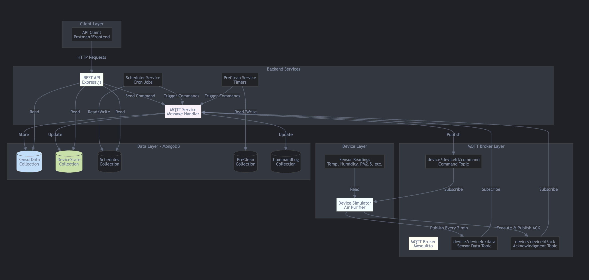
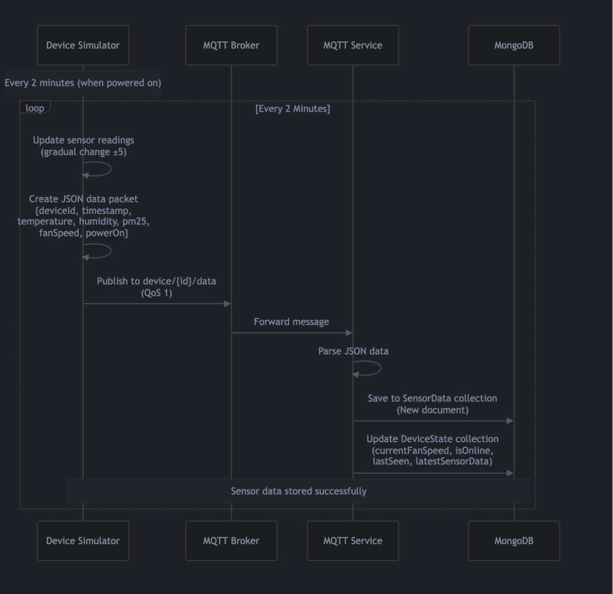
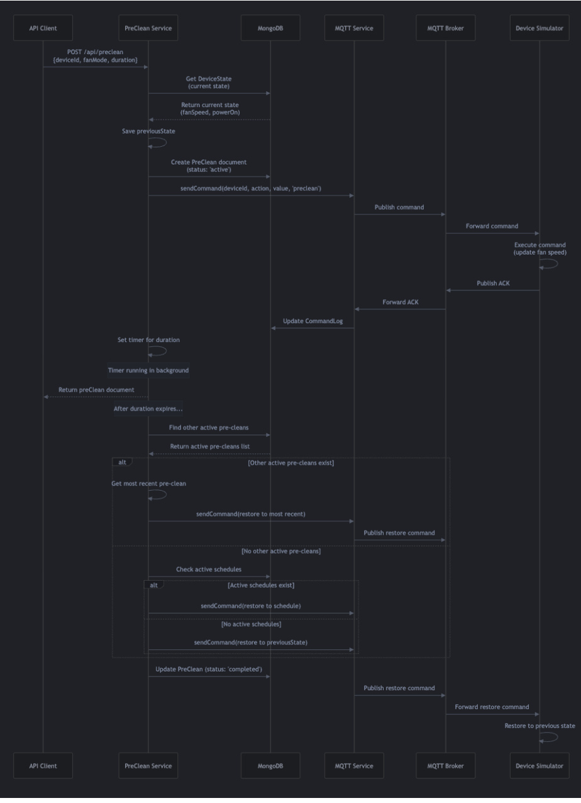
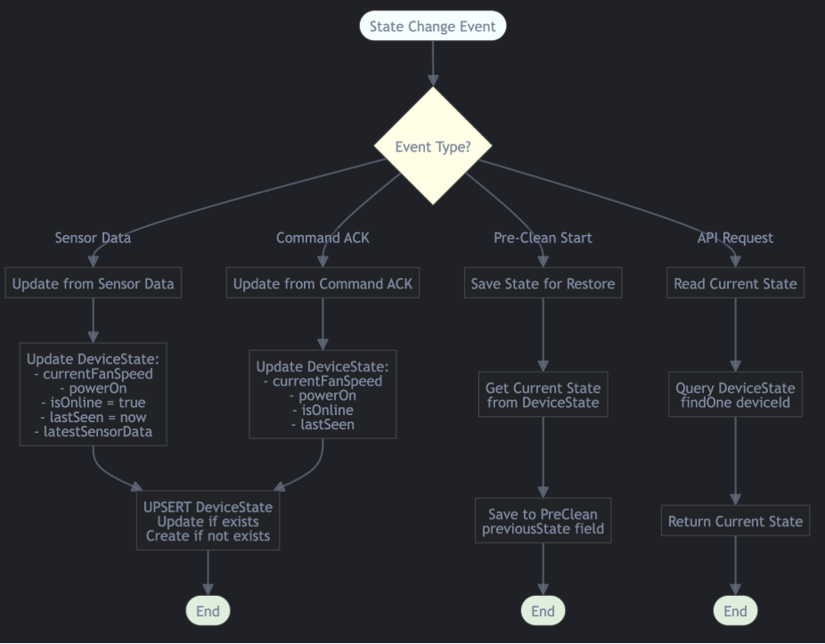
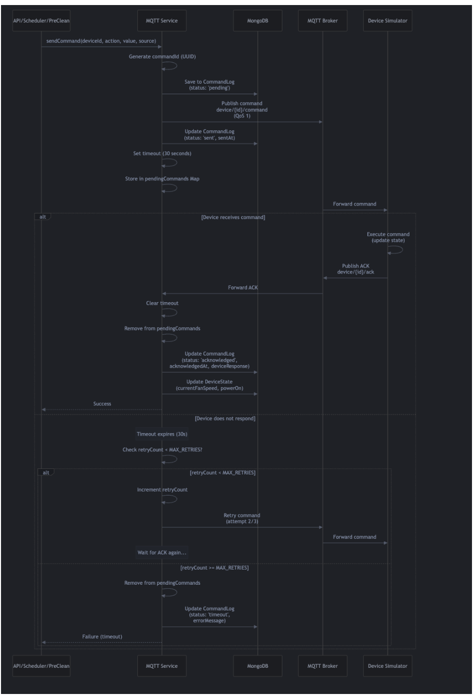

# Praan IoT Backend - Air Purifier Management System

A production-grade IoT backend system for managing air purifier devices with real-time MQTT data ingestion, device command orchestration, scheduling, and temporary override logic.

## Table of Contents

- [Overview](#overview)
- [Architecture](#architecture)
- [MQTT Communication](#mqtt-communication)
- [Database Models](#database-models)
- [API Documentation](#api-documentation)
- [Installation & Setup](#installation--setup)
- [Test Cases](#test-cases)
- [System Flows](#system-flows)
- [Trade-offs and Design Decisions](#trade-offs-and-design-decisions)

---

## Overview

This system consists of three main components:

1. **IoT Device Simulator** - Simulates an air purifier device that publishes sensor data and responds to commands
2. **Backend Server** - Node.js server that manages devices, stores data, and provides REST APIs
3. **MQTT Broker** - Message broker (Mosquitto) that facilitates communication between devices and backend

### What This System Does

- **Device Simulator**: JavaScript program that simulates an air purifier, sends sensor data, receives commands from backend, and responds to commands
- **Backend Server**: Receives data, stores it, and controls the air purifier through REST APIs
- **MQTT Broker**: Message queue telemetry transport following publisher-subscriber model for communication
- **APIs**: Remote controls for scheduling, pre-clean operations, and device management

---

## Architecture



### 5-Layer Architecture Overview

The system follows a layered architecture pattern with clear separation of concerns:

#### Layer 1: Device Layer
**Components:**
- Device Simulator (Air Purifier)
- Sensor Readings (Temp, Humidity, PM2.5, etc.)

**Purpose:** Simulates an IoT air purifier. Generates sensor readings and publishes them to MQTT.

**Responsibilities:**
- Generate sensor data every 2 minutes (when powered on)
- Subscribe to command topics to receive commands
- Execute commands (set fan speed, turn on/off)
- Publish acknowledgments after executing commands
- Maintain internal device state (fan speed, power status)

**Communication:**
- Publishes to: `device/deviceId/data` (sensor data)
- Publishes to: `device/deviceId/ack` (acknowledgments)
- Subscribes to: `device/deviceId/command` (commands)

#### Layer 2: MQTT Broker Layer
**Components:**
- MQTT Broker (Mosquitto)
- Data Topic: `device/deviceId/data`
- Command Topic: `device/deviceId/command`
- Acknowledgment Topic: `device/deviceId/ack`

**Purpose:** Message broker that routes messages between devices and backend using pub/sub.

**Responsibilities:**
- Receive messages from publishers (devices, backend)
- Route messages to subscribers based on topics
- Ensure message delivery (QoS 1 - at least once)
- Handle connections from multiple devices

**Communication Pattern:**
- Pub/Sub: Publishers don't know subscribers, subscribers don't know publishers
- Wildcard subscriptions: Backend subscribes to `device/+/data` (all devices)

#### Layer 3: Backend Services
**Components:**
- REST API (Express.js)
- MQTT Service (Message Handler)
- Scheduler Service (Cron Jobs)
- PreClean Service (Timers)

**REST API (Express.js)**
- Purpose: Provides HTTP endpoints for clients
- Responsibilities: Handle HTTP requests, validate data, call services, return JSON responses
- Endpoints: Device control, schedule management, pre-clean operations, device data

**MQTT Service (Message Handler)**
- Purpose: Handles all MQTT communication between backend and devices
- Responsibilities: Connect to MQTT broker, subscribe to topics, publish commands, implement retry logic
- Key Functions: `handleSensorData()`, `handleAcknowledgment()`, `sendCommand()`

**Scheduler Service (Cron Jobs)**
- Purpose: Manages recurring schedules using cron jobs
- Responsibilities: Load schedules, create cron jobs, execute schedule start/end, handle overlapping schedules
- Uses: node-cron library, stores active jobs in memory Map

**PreClean Service (Timers)**
- Purpose: Manages temporary fan override operations
- Responsibilities: Start pre-clean, manage timers, complete/cancel pre-clean, implement stack behavior
- Key Functions: `startPreClean()`, `completePreClean()`, `cancelPreCleanImmediately()`

#### Layer 4: Data Layer - MongoDB
**Components:**
- SensorData Collection (time-series data)
- DeviceState Collection (current device state)
- Schedules Collection (recurring schedule definitions)
- PreClean Collection (pre-clean operations)
- CommandLog Collection (audit trail)

**Purpose:** Persistent storage for all system data with optimized indexes for performance.

#### Layer 5: Client Layer
**Components:**
- API Client (Postman/Frontend/Mobile App)

**Purpose:** External clients that interact with the system via REST API.

**Types:** Postman (testing), Web Frontend (UI), Mobile App (control), Third-party integrations

### Data Flow Between Layers

#### Sensor Data Flow
```
Device Layer → MQTT Broker Layer → Backend Services (MQTT Service) → Data Layer (SensorData, DeviceState)
```

#### Command Flow
```
Client Layer → Backend Services (REST API) → Backend Services (MQTT Service) → MQTT Broker Layer → Device Layer
```

#### Acknowledgment Flow
```
Device Layer → MQTT Broker Layer → Backend Services (MQTT Service) → Data Layer (CommandLog, DeviceState)
```

#### Schedule Execution Flow
```
Data Layer (Schedules) → Backend Services (Scheduler Service) → Backend Services (MQTT Service) → MQTT Broker Layer → Device Layer
```

#### Pre-Clean Flow
```
Client Layer → Backend Services (REST API) → Backend Services (PreClean Service) → Backend Services (MQTT Service) → MQTT Broker Layer → Device Layer
```

---

## MQTT Communication

### MQTT Protocol

**MQTT** (Message Queue Telemetry Transport) is the message protocol used for communication between IoT device and backend service. It follows a publisher-subscriber model.

### MQTT Topics

- `device/AIR_PURIFIER_001/data` → Device sends sensor data to this topic
- `device/AIR_PURIFIER_001/command` → Backend sends commands to device
- `device/AIR_PURIFIER_001/ack` → Device sends acknowledgements back to backend

### Command Types

- **setFanSpeed** → Changes the fan speed (1-5)
- **turnOff** → Sets the fan to offline
- **turnOn** → Turn the device online

### Message Formats

#### Sensor Data (Device → Backend)
```json
{
  "deviceId": "AIR_PURIFIER_001",
  "timestamp": "2024-12-26T10:00:00.000Z",
  "temperature": 25.5,
  "humidity": 60.2,
  "pm25": 35.7,
  "fanSpeed": 2,
  "powerOn": true
}
```

#### Command (Backend → Device)
```json
{
  "commandId": "550e8400-e29b-41d4-a716-446655440000",
  "action": "setFanSpeed",
  "value": 3,
  "timestamp": "2024-12-26T10:00:00.000Z"
}
```

#### Acknowledgment (Device → Backend)
```json
{
  "deviceId": "AIR_PURIFIER_001",
  "commandId": "550e8400-e29b-41d4-a716-446655440000",
  "status": "success",
  "message": "Fan speed set to 3"
}
```

---

## Database Models

### SensorData Model
Stores historic sensor data for analytics and restoration.

| Field | Type | Description |
|-------|------|-------------|
| deviceId | String | Device identifier |
| timestamp | Date | When data was recorded |
| temperature | Number | Temperature in Celsius |
| humidity | Number | Humidity percentage |
| pm25 | Number | Particulate Matter 2.5 |
| fanSpeed | Number | Current fan speed (0-5) |
| powerOn | Boolean | Device power status |

### DeviceState Model
Stores current device state for fast lookups.

| Field | Type | Description |
|-------|------|-------------|
| deviceId | String | Device identifier |
| currentFanSpeed | Number | Current fan speed |
| powerOn | Boolean | Power status |
| isOnline | Boolean | Online status |
| lastSeen | Date | Last communication |

### Schedule Model
Stores recurring schedule definitions.

| Field | Type | Description |
|-------|------|-------------|
| deviceId | String | Device identifier |
| day | String | Day of week (Monday, Tuesday, etc.) |
| startTime | String | Start time (HH:MM) |
| endTime | String | End time (HH:MM) |
| fanSpeed | Number | Target fan speed (1-5) |
| isActive | Boolean | Whether schedule is enabled |

### PreClean Model
Stores pre-clean command data for temporary overrides.

| Field | Type | Description |
|-------|------|-------------|
| deviceId | String | Device identifier |
| fanSpeed | Number | Target fan speed (1-5) |
| duration | Number | Duration in minutes |
| previousState | Object | State before pre-clean |
| status | String | "active", "completed", "cancelled" |

---

## API Documentation

### Base URL: `http://localhost:3000`

#### Health & Info
| Method | Endpoint | Description |
|--------|----------|-------------|
| GET | `/health` | System health check |
| GET | `/` | API documentation |

#### Schedule APIs
| Method | Endpoint | Description |
|--------|----------|-------------|
| POST | `/api/schedule` | Create recurring schedule |
| GET | `/api/schedule/:deviceId` | Get all schedules for device |
| GET | `/api/schedule/detail/:scheduleId` | Get specific schedule |
| PUT | `/api/schedule/:scheduleId` | Update schedule |
| DELETE | `/api/schedule/:scheduleId` | Delete specific schedule |

#### Pre-Clean APIs
| Method | Endpoint | Description |
|--------|----------|-------------|
| POST | `/api/preclean` | Start temporary override |
| POST | `/api/preclean/cancel` | Cancel active pre-clean |
| GET | `/api/preclean/status/:deviceId` | Get pre-clean status |

#### Device APIs
| Method | Endpoint | Description |
|--------|----------|-------------|
| GET | `/api/device/:deviceId/data` | Get historical sensor data |
| GET | `/api/device/:deviceId/latest` | Get latest sensor reading |
| GET | `/api/device/:deviceId/state` | Get current device state |
| GET | `/api/device/:deviceId/commands` | Get command history |
| GET | `/api/device/:deviceId/statistics` | Get device statistics |
| GET | `/api/device/list/all` | List all devices |

#### Control APIs
| Method | Endpoint | Description |
|--------|----------|-------------|
| POST | `/api/control/power` | Turn device on/off |
| POST | `/api/control/fan` | Set fan speed |

#### Device Management APIs
| Method | Endpoint | Description |
|--------|----------|-------------|
| POST | `/api/devices/register` | Register new device |
| GET | `/api/devices` | List all registered devices |
| GET | `/api/devices/:deviceId` | Get device details |
| PUT | `/api/devices/:deviceId` | Update device |
| DELETE | `/api/devices/:deviceId` | Delete device |
| GET | `/api/devices/status/active` | Get active devices |

#### Alias APIs
| Method | Endpoint | Description |
|--------|----------|-------------|
| GET | `/api/alias/current` | Get current test device |
| POST | `/api/alias/set/:deviceId` | Set test device alias |

### Example API Calls

#### Create Schedule
```bash
POST /api/schedule
{
  "deviceId": "AIR_PURIFIER_001",
  "day": "Monday",
  "startTime": "09:00",
  "endTime": "17:00",
  "fanSpeed": 3
}
```

#### Start Pre-Clean
```bash
POST /api/preclean
{
  "deviceId": "AIR_PURIFIER_001",
  "fanMode": 5,
  "duration": 10
}
```

---

## System Flows

### 1. Sensor Data Flow

**Requirement:** Generate sensor data every 2 minutes with gradual changes (no sudden jumps).



**Implementation Steps:**
1. Device simulator starts and connects to MQTT broker
2. Connection event fires → Initialize timer (one-time setup)
3. `setInterval(publishSensorData, 120000)` - 120000ms = 2 minutes
4. `publishSensorData()` method runs every 2 minutes:
   - Check if device is powered on (`deviceState.powerOn`)
   - If OFF → Stop data flow
   - If ON → Call `updateSensorReadings()`
   - Create data packet object
   - Convert to JSON using `JSON.stringify()`
   - Publish to MQTT topic `device/{deviceId}/data`

**Gradual Value Generation:**
```javascript
generateGradualValue(currentValue, min, max) {
  const maxChange = 5;
  const change = Math.random() * (maxChange * 2) - maxChange; // ±5
  const newVal = currentValue + change;
  return Math.max(min, Math.min(max, newVal)); // Bound check
}
```

**Example:**
- Current: 25.5°C, Min: 15°C, Max: 35°C
- Change: -2.3 → New: 23.2°C
- Bounds check: max(15, min(35, 23.2)) = 23.2°C

### 2. Schedule Flow

**Requirement:** Create APIs to manage recurring schedules with priority handling.


**Priority System:**
- Multiple schedules → Highest fan speed wins
- Pre-clean active → Block schedule commands
- Schedule end → Cancel active pre-cleans

**Implementation Steps:**
1. **Create Schedule:** `POST /api/schedule` → Save to MongoDB
2. **Cron Job Creation:** Schedule service reads DB → Creates cron expressions
3. **Active Jobs:** Store in `activeJobs.set(scheduleId_StartTime, cronJob)`
4. **Schedule Start:** `executeScheduleStart()` triggered:
   - Check intervals (currently no interval)
   - Query active schedules for current time
   - **Priority Queue:** Handle multiple schedules
   - **Pre-clean Check:** Block if active pre-clean exists
   - Send command to device
   - Update schedule history
5. **Schedule End:** `executeScheduleEnd()` triggered:
   - Get active schedules
   - Check for active pre-cleans → Cancel if found
   - Turn off device or switch to next priority schedule

**Priority Logic:**
```
Multiple Schedules Active:
├─ Schedule1 (Fan Speed 5) ← Highest Priority
├─ Schedule2 (Fan Speed 3) ← Blocked
└─ Schedule3 (Fan Speed 2) ← Blocked

Result: Only Schedule1 executes
```

### 3. Pre-Clean Flow

**Requirement:** Immediately trigger fan speed change with automatic restoration.



**Fan Mode Logic:**
- `PRE_CLEAN` → Fan Speed 5 (maximum)
- `AUTO` → Fan Speed 3
- `MANUAL` → Custom fan speed
- `OFF` → Fan Speed 0 (turn off)

**Implementation Steps:**
1. **API Request:** `POST /api/preclean`
2. **Get Current State:** Query `DeviceState.findOne({deviceId})`
3. **Save Previous State:** Store current fan speed and power status
4. **Determine Target Speed:** Based on fanMode
5. **Create PreClean Document:** Status 'active'
6. **Send Command:** Via MQTT Service
7. **Set Timer:** In-memory `setTimeout(duration)`
8. **Return Response:** PreClean document to user
9. **Timer Expires:** Find other active pre-cleans
10. **Restoration Logic:**
    - Other pre-cleans active → Restore to most recent
    - No pre-cleans → Check active schedules
    - No schedules → Restore to previous state
11. **Mark Completed:** Update PreClean status

**Stack Behavior:**
```
Time: T0 - Original State (Fan Speed 2)
│
├─ T1: PreClean1 (Speed 3, 5min) ← Stack Bottom
│
├─ T2: PreClean2 (Speed 5, 10min) ← Stack Top
│
└─ T3: PreClean2 Completes → Restore to PreClean1 (Speed 3)
   T4: PreClean1 Completes → Restore to Original (Speed 2)
```

### 4. State Update Flow

**Purpose:** Maintain single source of truth for device state.



**State Change Events:**
- **Sensor Data:** Update from device readings
- **Command ACK:** Update from command acknowledgments
- **Pre-Clean Start:** Save state for restoration
- **API Request:** Read current state

**Implementation:**
```javascript
// Sensor Data Update
handleSensorData(data) {
  DeviceState.updateOne({deviceId}, {
    currentFanSpeed: data.fanSpeed,
    powerOn: data.powerOn,
    isOnline: true,
    lastSeen: new Date(),
    latestSensorData: data
  }, {upsert: true});
}

// Command ACK Update
handleAcknowledgment(ack) {
  DeviceState.updateOne({deviceId}, {
    currentFanSpeed: ack.fanSpeed,
    powerOn: ack.powerOn,
    lastSeen: new Date()
  });
}
```

### 5. Command & Acknowledgment Flow

**Requirement:** Reliable command delivery with retry mechanism.



**Command Sources:**
- Manual Control: `/api/control/fan`, `/api/control/power`
- Schedule: Automated cron jobs
- Pre-Clean: Temporary overrides

**Implementation Steps:**
1. **Generate Command:** Create UUID for tracking
2. **Create CommandLog:** Status 'pending'
3. **Priority Check:** Handle schedule/pre-clean priorities
4. **Publish Command:** `device/{deviceId}/command` (QoS 1)
5. **Update Status:** 'sent' after publishing
6. **Set Timeout:** 30-second retry timer
7. **Device Execution:** Device receives and executes
8. **ACK Response:** Device publishes acknowledgment
9. **Update Success:** Clear timeout, update status to 'acknowledged'
10. **Update DeviceState:** Reflect new device state

**Retry Logic:**
```javascript
const MAX_RETRIES = 3;
const RETRY_TIMEOUT = 30000; // 30 seconds

for (let retry = 0; retry < MAX_RETRIES; retry++) {
  publishCommand();
  const ackReceived = await waitForAck(RETRY_TIMEOUT);
  if (ackReceived) {
    updateStatus('acknowledged');
    break;
  }
  if (retry === MAX_RETRIES - 1) {
    updateStatus('timeout');
  }
}
```

**Buffer Management:**
- Multiple commands can be pending simultaneously
- `pendingCommands` Map tracks active commands
- Commands cleared on ACK or timeout
- Prevents duplicate commands

**Error Handling:**
- **Timeout:** Command marked as 'timeout' after max retries
- **Device Offline:** Commands queued until device reconnects
- **Invalid Commands:** Rejected with error status
- **Duplicate ACKs:** Ignored if command already acknowledged

### Prerequisites

1. **Node.js** (v18 or higher)
2. **MongoDB** (v7.0 or higher)
3. **Mosquitto MQTT Broker**

### Installation Steps

1. **Clone and install dependencies**:
```bash
git clone <repository-url>
cd praan-task
npm install
```

2. **Configure environment**:
```bash
cp env.example .env
# Edit .env with your settings
```

3. **Start MongoDB**:
```bash
mongod
```

4. **Start Mosquitto MQTT Broker**:
```bash
mosquitto -c mosquitto/config/mosquitto.conf
```

5. **Start Backend Server**:
```bash
npm start
# or for development:
npm run dev
```

6. **Start Device Simulator**:
```bash
npm run simulator
```

### Environment Configuration

```env
# MQTT Broker Configuration
MQTT_BROKER_URL=mqtt://localhost:1883

# MongoDB Configuration
MONGODB_URI=mongodb://localhost:27017/praan-iot

# Backend Server Configuration
PORT=3000
NODE_ENV=development

# Device Configuration
DEVICE_ID=AIR_PURIFIER_001
```

---

## Test Cases

| Test Case | API Call | Expected Output |
|-----------|----------|-----------------|
| Turn on power with fan speed 0 | `POST /api/control/power` | Device turns online, auto-off after 10s |
| Set Fan Speed | `POST /api/control/fan` | Fan speed set to specified value |
| Turn fan offline | `POST /api/control/power` | Device turns offline |
| Create schedule | `POST /api/schedule` | Schedule created, cron job active |
| Start Pre-Clean | `POST /api/preclean` | Pre-clean starts, overrides schedule |
| Auto Restore | Wait for duration | Fan restores to previous state |
| Schedule Execution | Wait for time | Device turns on/off automatically |

---

## System Flows

### Sensor Data Flow
1. Device publishes sensor data every 2 minutes
2. Backend receives via MQTT and stores in MongoDB
3. Device state is updated with latest readings

### Schedule Flow
1. API creates schedule in MongoDB
2. Cron job triggers at scheduled time
3. Command sent to device via MQTT
4. Device acknowledges command execution

### Pre-Clean Flow
1. Current device state is saved
2. Immediate fan speed change command sent
3. Timer set for specified duration
4. Auto-restore to previous state after completion

### Command & Acknowledgement Flow
1. Command generated with unique ID
2. Published to MQTT command topic
3. Device executes and sends acknowledgment
4. Backend updates command status and device state

---

## Trade-offs and Design Decisions

### 1. MQTT vs HTTP for Device Communication
- **Decision**: Used MQTT
- **Why**: Lightweight, designed for IoT, supports pub/sub, low bandwidth
- **Trade-off**: Better real-time communication despite needing MQTT broker

### 2. MongoDB vs SQL Database
- **Decision**: Used MongoDB
- **Why**: Flexible schema, good for time-series data, easy horizontal scaling
- **Trade-off**: Flexibility and scalability over strict data integrity

### 3. Simple Cron vs Queue System
- **Decision**: Used node-cron
- **Why**: Simple setup, built into Node.js, perfect for demo
- **Trade-off**: Easy to understand but jobs lost on server restart

### 4. In-Memory Timers vs Database Timers
- **Decision**: Used setTimeout with database backup
- **Why**: Pre-clean needs precise timing, in-memory is fast and accurate
- **Trade-off**: Speed and precision but timers lost on restart

---

## Project Structure

```
praan-task/
├── frontend/
│   └── index.html                          # Simple frontend (if needed)
├── mosquitto/
│   └── config/
│       └── mosquitto.conf                  # Local MQTT broker config
├── postman/
│   └── Praan-IoT-Backend.postman_collection.json  # API testing collection
├── scripts/
│   └── setup-devices.js                   # Device registration script
├── src/
│   ├── backend/
│   │   ├── middleware/
│   │   │   └── deviceAlias.js              # Device alias system
│   │   ├── models/
│   │   │   ├── CommandLog.js               # Command history
│   │   │   ├── Device.js                   # Device registration model
│   │   │   ├── DeviceState.js              # Real-time device state
│   │   │   ├── PreClean.js                 # Pre-clean operations
│   │   │   ├── Schedule.js                 # Recurring schedules
│   │   │   └── SensorData.js               # Sensor readings
│   │   ├── routes/
│   │   │   ├── aliasRoutes.js              # Device alias management
│   │   │   ├── controlRoutes.js            # Manual device control
│   │   │   ├── deviceManagementRoutes.js   # Device CRUD operations
│   │   │   ├── deviceRoutes.js             # Device data & state
│   │   │   ├── precleanRoutes.js           # Pre-clean operations
│   │   │   └── scheduleRoutes.js           # Schedule management
│   │   ├── services/
│   │   │   ├── mqttService.js              # MQTT communication
│   │   │   ├── preCleanService.js          # Pre-clean logic
│   │   │   └── schedulerService.js         # Schedule execution
│   │   ├── utils/
│   │   │   └── logger.js                   # Logging utility
│   │   └── server.js                       # Main server file
│   ├── logs/
│   │   ├── combined.log                    # All logs
│   │   └── error.log                       # Error logs only
│   └── simulator/
│       └── device-simulator.js             # IoT device simulator
├── .env                                    # Environment variables
├── .gitignore                              # Git ignore rules
├── env.example                             # Environment template
├── package-lock.json                       # Dependency lock file
├── package.json                            # Project dependencies & scripts
└── README.md                               # Project documentation
```

---

## Support

For questions or issues:
1. Check logs in `src/logs/` directory
2. Verify all services are running
3. Test MQTT broker connectivity
4. Use Postman collection for API testing

---

## License

This project is created for demonstration purposes.